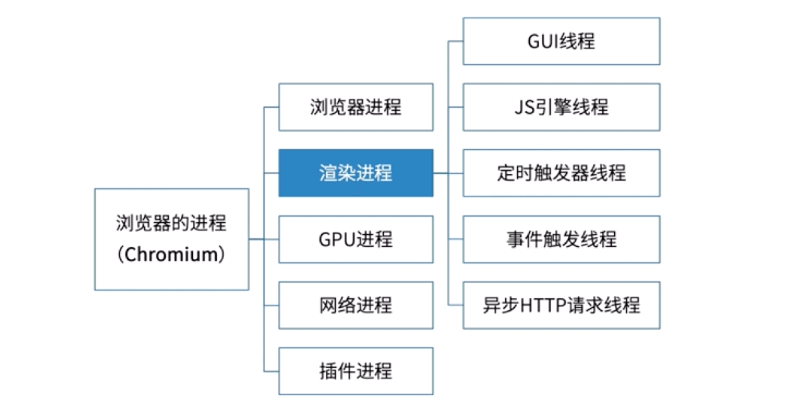

# 事件循环 异步

首先介绍几个概念，这里先做了解，后面用到再看。
* 同步任务   
  整个script脚本，除异步任务外，都是同步任务。。。

* 异步任务   
  包括`setTimeout, setInterval, promise.then,` 各种事件绑定等。  


* 其中异步任务又分为
  * 宏任务
   ` setTimeout, setInterval, ajax请求，`各种事件绑定等。
  * 微任务`promise.then`


下面介绍我们运行js代码拥有哪些东西。  
* js执行栈(js主线程)  
* 运行环境(这里主要指的是浏览器)  
* 宏任务队列  
* 微任务队列   
  如下图所示


由于js是单线程的，所以任务只能一个个执行，下面我们整理一下代码的执行流程。    
* 1.js代码从上往下执行，同步任务直接执行。
* 2.如遇到异步任务则需要判断是宏任务还是微任务，把宏任务加入到宏任务队列，微任务加入到微任务队列。
* 3.执行栈中任务执行完毕，js线程空闲，检查微任务队列是否有微任务，如果有则把微任务加入执行栈并执行，直到微任务队列为空。
* 4.当执行栈，微任务队列都为空时，检查宏任务队列是否有宏任务，如果有取第一个加入执行栈并执行，回到第一步。
* 简单来说就是  同步任务 --> 所有微任务 --> 单个宏任务 --> 所有微任务 --> 单个宏任务 如此循环。  
  
下面代码演示。
```js
    console.log(1); // 同步任务立马执行

    setTimeout(() => {
      console.log(2); // 异步宏任务 放入宏任务队列
    }, 0);

    new Promise((resolve, reject) => {
      resolve();
    }).then(() => {
      console.log(3); // 异步微任务 放入微任务队列
    });

    console.log(4); // 同步任务立马执行
```
打印结果为 `1 4 3 2 `    
::: tip
这里需要注意：只要执行栈为空，就会把微任务队列的所有任务处理完。而宏任务则是一个一个的处理。这样做的目的是可以实现插队。  
:::
下面看代码  
```js
    console.log(1); // 同步任务立马执行

    setTimeout(() => {
      console.log(2); // 异步宏任务 放入宏任务队列

      new Promise((resolve, reject) => {
        resolve();
      }).then(() => {
        console.log(3); // 异步微任务 放入微任务队列
      });
    }, 0);

    setTimeout(() => {
      console.log(4);
    }, 0);

    console.log(5); // 同步任务立马执行
```
打印结果是 `1 5 2 3 4`。   
这里我们可以看到 宏任务队列有两个任务 分别是打印 2 和打印 4，但是因为打印 2 这个宏任务中又产生了打印 3 的微任务。按照事件循环机制，执行完一个宏任务后会清空微任务队列，所以先打印了3。   
这样我们就利用了微任务进行插队。  

最后我们解释一下运行环境的作用，当我们设置`setTimeout`的时候js线程并不会去计时，而是在运行环境中创建一个任务，这个任务就是计时对应的时间后把回调函数放入相应的任务队列。
那么由此可知，`setTimeout`定时的任务并不一定会准时执行，而是最快那个时间执行。  
* 下图解释了浏览器的进程。
  
  
