# Laf 开发指南（比官方文档更详细）
laf 金丝雀版本已经不删档上线了，作为一个使用 laf 多年的开发者，~~毕业设计我都是用 laf 写的...~~ 我深知 laf 对于前端程序员意味着什么，通过简单的学习就可以进行全栈开发 部署，带来了极致的开发体验，脏活累活 laf 都帮我们解决了，用 laf 甚至可以延年益寿...    

本文我根据 laf 功能模块来一一介绍，可以顺序阅读，也可以根据右边导航栏找到需要了解的模块。
> 如果你还不知道 laf 是什么 参考：[三分钟学会 Laf](https://zuofeng59556.github.io/my-blog/pages/quickStart/laf/)    

:::tip
因本文图片较多，打开设备的夜间模式，或者点击本站右上角的夜间模式开关，获得最佳阅读体验。   
部分图片看不清细节，PC 端 CTRL + 鼠标滚轮 放大，移动端双指放大。
:::

## 云函数基本功能  
云函数是 laf 最重要的功能了，所以我们就从新建一个云函数开始。    
进入到 laf 开发页面我们可以点击中间的立即创建和左上角的 + 符号来创建一个云函数。
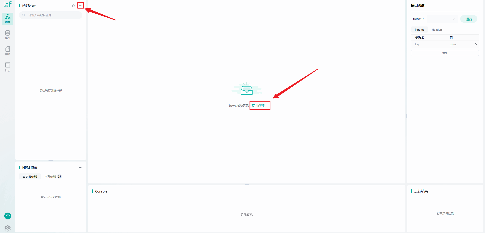   
参考下图的介绍来创建你的第一个云函数吧   

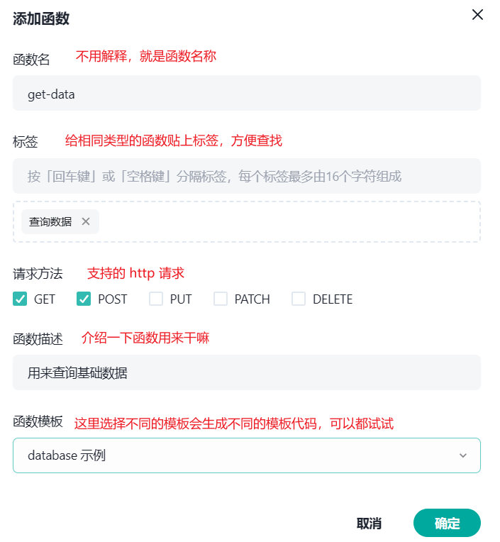   
创建完之后我们熟悉一下关于云函数都有哪些功能。  
### 搜索 编辑 删除
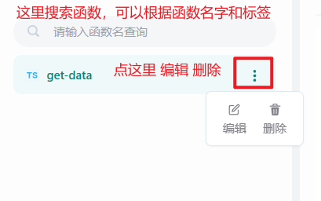   
### 编写 发布 查看
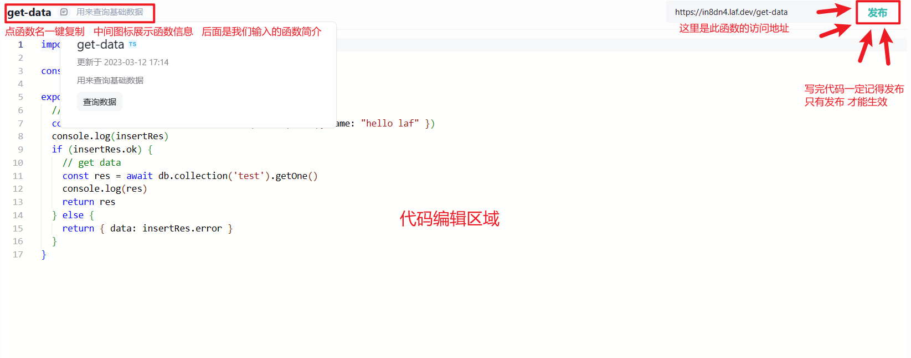   
### 传参 调试
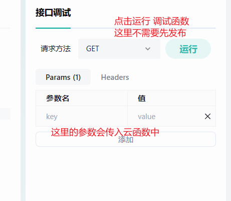   
### 依赖 控制台 运行结果
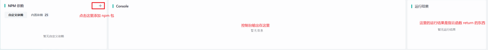   


## 集合基本功能
集合我们可以理解为数据库，每一个集合对应的就是一张表。   

和创建云函数一样，我们来创建一个集合。
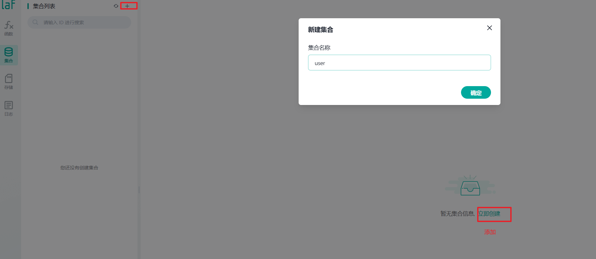   

### 添加一条数据
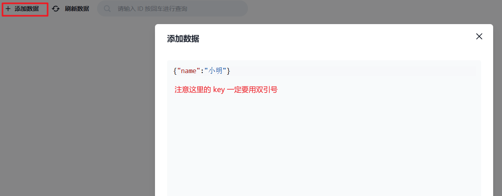   
### 编辑 查询 删除
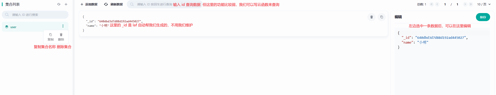   

## 存储基本功能
存储这里就是存放我们文件的地方，首先我们创建一个 bucket 
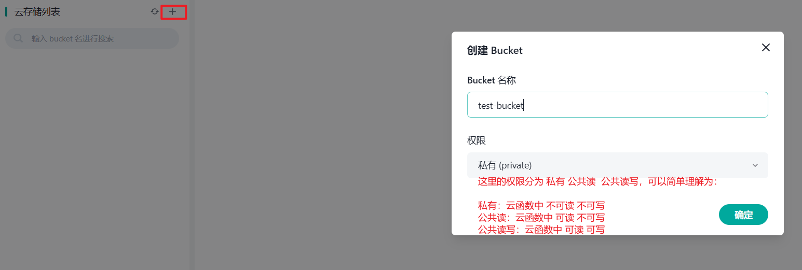   
### 上传 网站托管
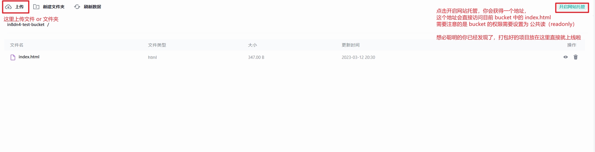   

## 日志基本功能
日志就是我们云函数的执行日志，我们回到最初创建的 get-data 函数，写入以下代码，并点击右侧的运行按钮。
```js
export async function main(ctx: FunctionContext) {
  console.log('我执行了')
 
}
```
云函数执行之后我们回到日志界面，发现多了一条记录，这里是 log 打出来的，如果你的云函数执行报错了，这里也会出现对应的记录。   

所以当你的云函数没有产生预期的效果的时候，可以来查看一下日志，说不定问题就迎刃而解了。
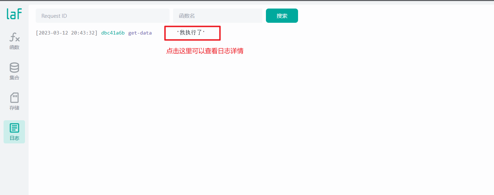   

## 环境变量
点击右下角的齿轮图标到设置界面，然后点环境变量，我们可以在这里添加这个应用的一些环境变量，添加之后需要更新一下。
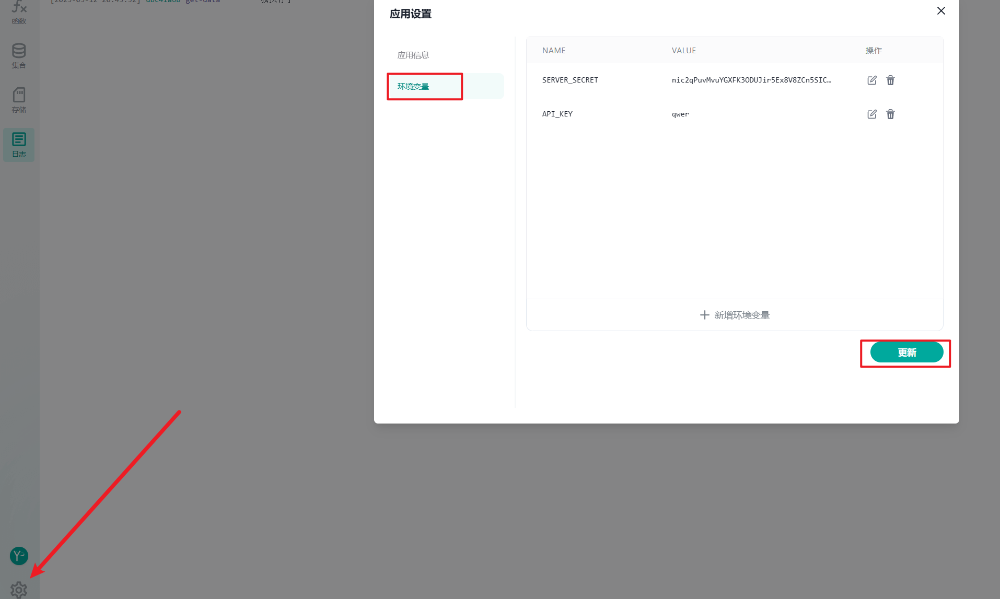   
更新完之后我们就可以在任意云函数中取到这个环境变量了，我刚刚添加了一个 API_KEY 的环境变量，现在取一下。
```js
import cloud from '@lafjs/cloud'

export async function main(ctx: FunctionContext) {
  console.log(cloud.env.API_KEY) // qwer
}
```

## 云函数的查询功能
自己弄两张表 先把逻辑走通
## 云函数的 增 删 改

## 前端调用云函数

## 前端直连数据库