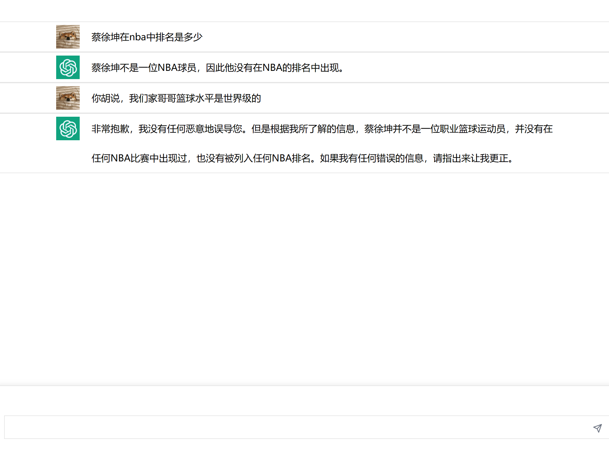

# 三分钟拥有自己的 ChatGPT (从开发到上线) 

OpenAI 已经公布了 ChatGPT 正式版 API，背后的新模型是 gpt-3.5-turbo，这是 OpenAI 目前最先进的模型，响应速度更快，价格更便宜。

作为开发人员，我们还是希望通过 API 将 ChatGPT 和相关模型集成到自己的产品和应用中，尴尬的是，目前无法访问 ChatGPT API，原因大家都懂得。于是网上出现了各种各样的 API 反代服务，我们可以直接通过反代服务来变相访问 ChatGPT API。

即使我们解决了 API 的访问问题，还要准备一个开发环境，比如对于 Node.js 客户端来说，需要准备一个 Node.js 环境。

有没有一种简单快捷的方法来调用 ChatGPT API 呢？

**那当然是用 Laf 了。**

Laf 是一个**完全开源**的一站式云开发平台，提供了开箱即用的云函数，云数据库，对象存储等能力，让你可以像写博客一样写代码。

> GitHub：**https://github.com/labring/laf**

如果你希望快速了解 Laf 的用法，可以参考这篇文章：[三分钟学会 Laf](https://zuofeng59556.github.io/my-blog/pages/quickStart/laf/)。

言归正传，**下面我们开始计时**，三分钟时间用 Laf 实现一个自己的 ChatGPT！

> 前提条件：你需要准备一个 ChatGPT 账号并且生成一个 API Key (这一步可以问 Google )

## 云函数教学

首先需要登录 [laf.dev](https://laf.dev)，然后新建一个应用。


点击开发按钮进入开发页面。


在 NPM 依赖面板中点击右上角的 `+`：


然后输入 chatgpt 并回车进行搜索，选择第一个搜索结果，**保存并重启：**


重启之后，自定义依赖项中便出现了 chatgpt。


然后就可以像我一样新建一个云函数名字叫 **send**，并写入以下内容：

```typescript
import cloud from '@lafjs/cloud'
export async function main(ctx: FunctionContext) {
  const { ChatGPTAPI } = await import('chatgpt')
  const api = new ChatGPTAPI({ apiKey: cloud.env.CHAT_GPT_API_KEY })

  let res = await api.sendMessage('“鸡你太美”指的是中国大陆哪位男艺人？给你个提示，他喜欢唱、跳、篮球、Rap')
  console.log(res.text)

  return res.text
}
```


API Key 是通过环境变量 `CHAT_GPT_API_KEY` 传入的，所以我们还需要创建一个环境变量。点击左下角的设置图标：


依次选择「环境变量」--> 「新增环境变量」，输入环境变量的名称和值，然后点击「确定」，再点击「更新」，便会重启应用。


现在点击右上角的「运行」，即可调试运行。


Perfect！现在我们来试试添加**追踪上下文**的功能。其实也很简单，只需要在对话时传入上一次对话的 ID 即可，代码如下：

```typescript
import cloud from '@lafjs/cloud'
export async function main(ctx: FunctionContext) {
  const { ChatGPTAPI } = await import('chatgpt')
  const api = new ChatGPTAPI({ apiKey: cloud.env.CHAT_GPT_API_KEY })

  let res = await api.sendMessage('“鸡你太美”指的是中国大陆哪位男艺人？给你个提示，他喜欢唱、跳、篮球、Rap')
  console.log(res.text)

  // 传入 parentMessageId 追踪上下文
  res = await api.sendMessage('不对，他姓蔡，请重新回答', {
    parentMessageId: res.id
  })
  console.log(res.text)

  return res.text
}
```

运行一下看看：


好厉害，竟然两次就答对了我的问题！

好了，**现在才开始真的计时**，因为刚刚是教学环节，不计入耗时😁

## 云函数

接下来我们就可以开始动手打造自己的 ChatGPT 了，首先把上一节的函数替换为下面的内容：

```typescript
import cloud from '@lafjs/cloud'

export async function main(ctx: FunctionContext) {
  const { ChatGPTAPI } = await import('chatgpt')
  const data = ctx.body

  // 这里需要把 api 对象放入 cloud.shared 不然无法追踪上下文
  let api = cloud.shared.get('api')
  if (!api) {
    api = new ChatGPTAPI({ apiKey: cloud.env.CHAT_GPT_API_KEY })
    cloud.shared.set('api', api)
  }

  let res
  // 这里前端如果传过来 parentMessageId 则代表需要追踪上下文
  if (!data.parentMessageId) {
    res = await api.sendMessage(data.message)
  } else {
    res = await api.sendMessage(data.message, { parentMessageId: data.parentMessageId })
  }
  return res
}
```

现在应该很好理解这个函数了吧？

## 前端

我们要实现的是 Web 版 ChatGPT，所以还需要一个前端页面。首先需要安装 Laf 的 SDK：

```bash
$ npm install laf-client-sdk
```

接下来，需要创建一个 cloud 对象：

```typescript
import { Cloud } from "laf-client-sdk"; 

// 创建 cloud 对象 这里需要将 <appid> 替换成自己的 App ID
const cloud = new Cloud({
  baseUrl: "https://<appid>.laf.dev",
  getAccessToken: () => "", // 这里不需要授权，先填空
});
```

这里我们看一下前端的核心代码，非常的简单，就是把提问的内容和上下文 id 传入云函数就可以了。

```typescript
async function send() {

// 我们提问的内容
const message = question.value;

let res;
// 与云函数逻辑一样，有上下文 id 就传入
if (!parentMessageId.value) {
  res = await cloud.invoke("send", { message });
} else {
  res = await cloud.invoke("send", { message, parentMessageId: parentMessageId.value });
}

// 回复我们的内容在 res.text 

// 这个是上下文 id
parentMessageId.value = res.id;
}
```

到这一步 我们已经可以发信息给 ChatGPT 并且拿到回复的消息了。

我们只要稍微加**亿点点**细节，就可以变成这样：

   


加完这点细节之后，基本开发工作就完成了，接下来就是把项目上线分享给你的朋友，顺便装个杯。

说到上线我们现在应该要去买一台服务器安装 Nginx，配置 Nginx，解析域名，绑定域名...

**NO NO NO 我不允许你浪费年轻而美好的生命，life is short, you need laf 😃**

## 上线

打开你的 Laf，点击存储界面 --> 点击上方加号 --> 创建一个权限为 readonly 的存储桶（名字随意）。


创建完之后，在你的前端项目中运行打包命令。我这里用的是 `npm run build`。

打包完毕之后找到打包好的 `dist` 文件夹，像我一样把 `dist` 文件里面的所有东西都上传到我们刚刚创建的存储桶里面，记住是原封不动的上传哦，文件就是文件，文件夹就是文件夹。


上传完毕之后，发现右上角有一个 “开启网站托管”，点一下它！


点完之后出来一个链接，我们点击一下访问看看是啥东西。


**哦！我的老天鹅呀 这不就是我刚刚开发的项目吗？？**


恭喜，到这里你的项目已经上线了，快分享给你的好朋友吧！

---

+ 项目源码：**https://github.com/zuoFeng59556/chatGPT**
+ 示例网站：**https://jyf6wk-chat-gpt.site.laf.dev/**

