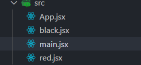
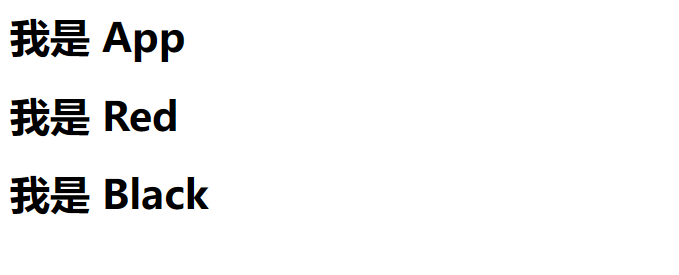
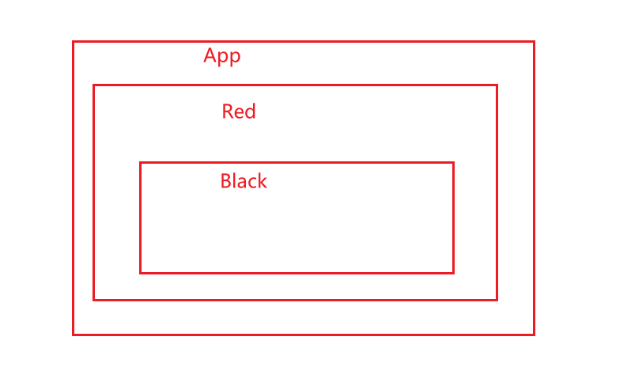
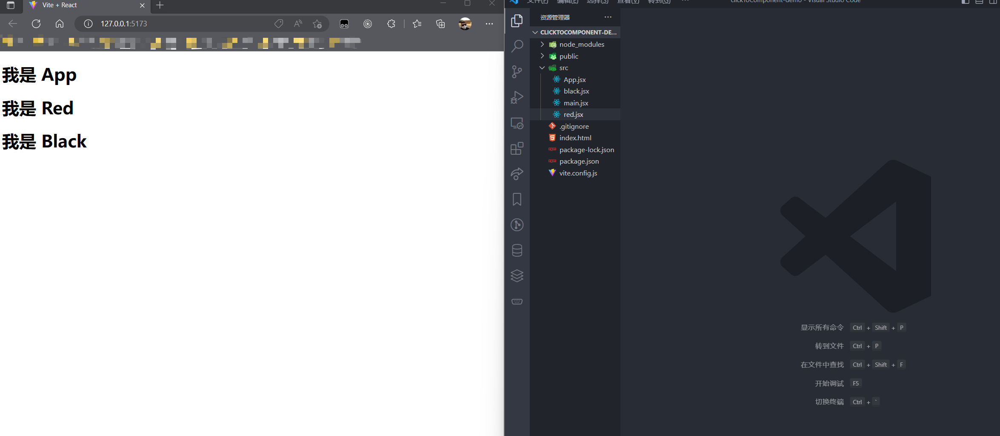
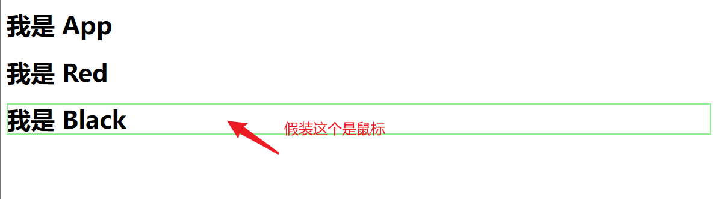
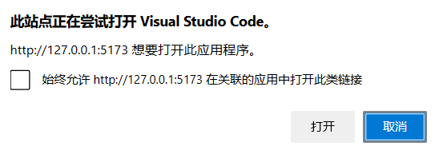
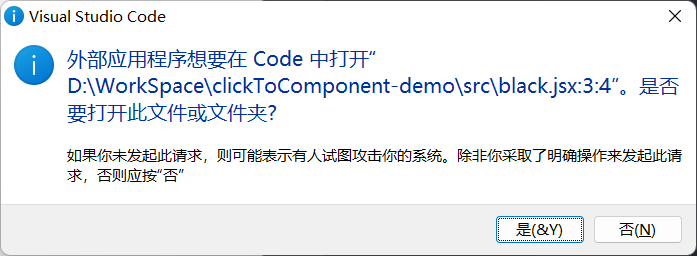
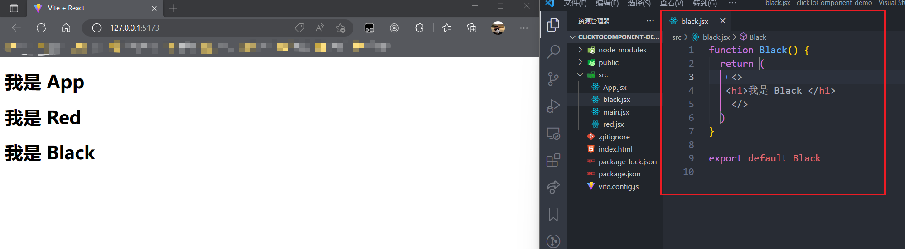
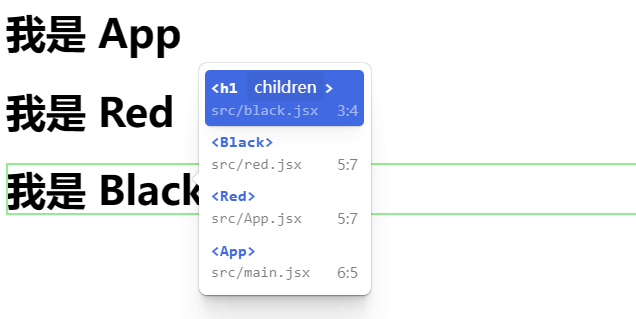

# 三分钟学会 ClickToComponent
## 起步
老规矩创建一个项目用 `vscode` 打开
```
npm create vite clickToComponent-demo --template react
cd clickToComponent-demo
// 这里顺手把依赖装了
npm i 
npm install click-to-react-component
code .
```
删除 `src` 下面的多余文件，保留 `App.jsx` `main.jsx` 并创建 `black.jsx` `red.jsx`    
   
分别写入以下代码
`main.jsx`
```js
import React from 'react'
import ReactDOM from 'react-dom/client'
import App from './App'
// 这里引入
import { ClickToComponent } from "click-to-react-component"; 

ReactDOM.createRoot(document.getElementById('root')).render(
  <React.StrictMode>
    <App />
    {/* 这里使用 */}
    <ClickToComponent />
  </React.StrictMode>,
)
```

`black.jsx`
```js
function Black() {
  return (
    <>
   <h1>我是 Black </h1>      
    </>
  )
}
export default Black
```
`red.jsx`
```js
import Black from "./black"
function Red() {
  return (
    <>
      <h1>我是 Red</h1>      
      <Black/>
    </>
  )
}
export default Red
```
`App.jsx`
```js
import Red from "./red"
function App() {
  return (
    <>
      <h1>我是 App</h1>      
      <Red/>
    </>
  )
}
export default App
```
`npm run dev` 运行
   
这里我们的项目情况是 Red 组件包含 Black 而 App 组件包含 Red
   

## 使用
首先像我这样把浏览器和 `vscode` 同时放在屏幕上，`vscode` 先不要打开文件
   
然后按住 `alt` ( mac 按 option ) 键把鼠标放在浏览器上，你会发现这里出现一个绿色的框，左键点击它
   
如果你和我一样是 windows 可能会遇到以下提示，同意就行了
   
   
你会惊奇的发现，你的 `vscode` 为你打开了你所点击的组件文件   
我点击的是 Black 所以打开了 `black.jsx` 文件
   
如果你按住 `alt` ( mac 按 option ) 加右边右键点击，会弹出组件的包含关系，点击组件名字也可以打开对应的文件。
  
**这也太酷了吧！！！！！！**
---
> 如果本文对你有帮助，可以去 Github 给我的博客点个 star 嘛    
> **https://github.com/zuoFeng59556/my-blog**