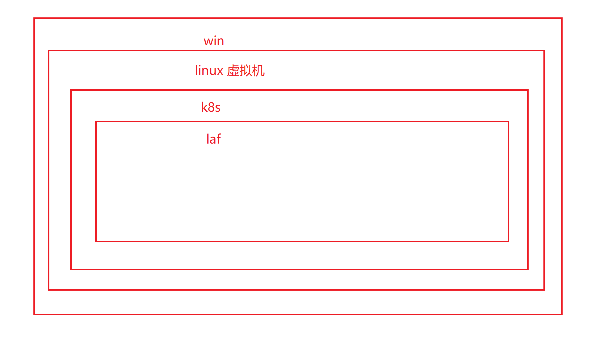
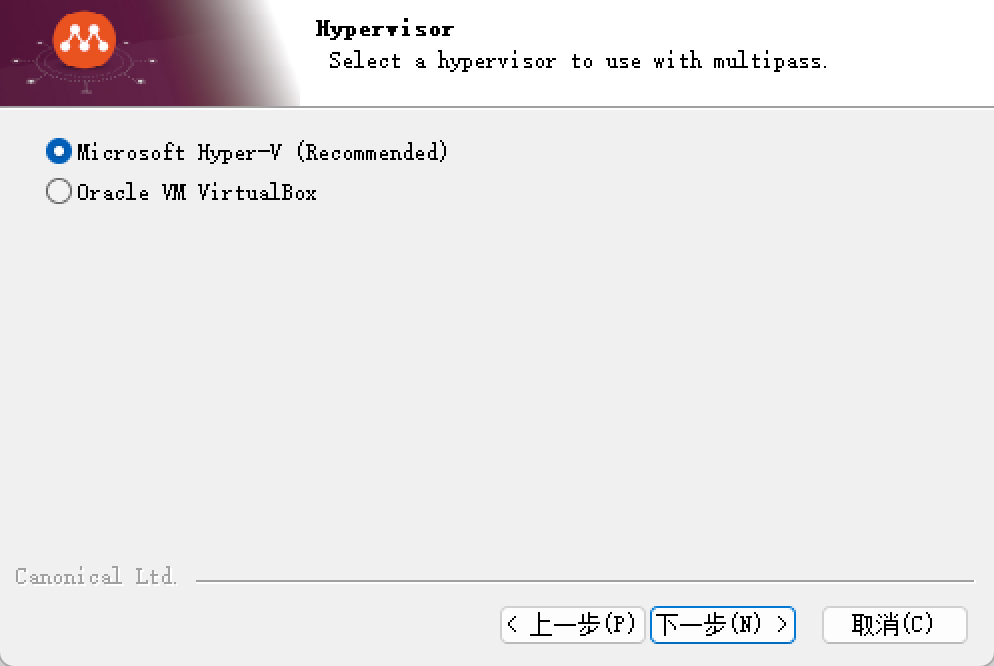
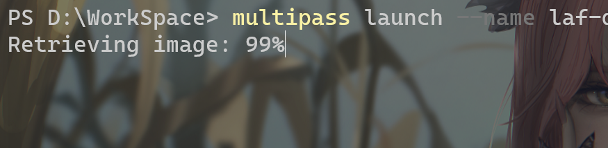
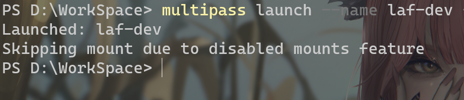
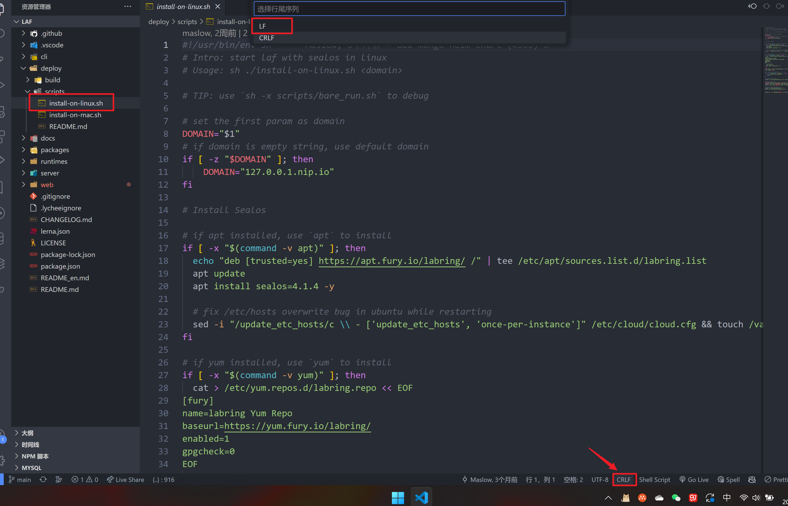
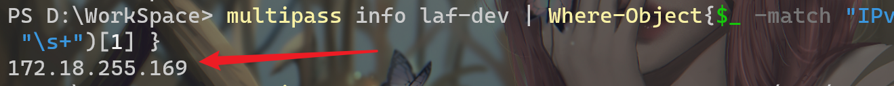
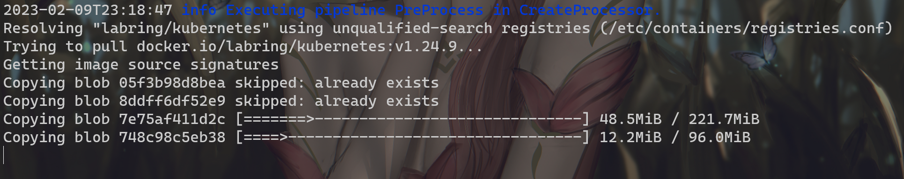

# 三分钟部署 laf
## 起步
演示系统： win11专业版（这里一定是专业版，家庭版的同学去某宝花几块钱升级一下）   

首先我们需要用到一个工具 Multipass。   
- `Multipass` 是快速创建一个 `linux` 虚拟机的工具。   
- 我们创建 `linux` 虚拟机干啥呢？用来部署 `k8s` 。   
- 什么是 `k8s` ？ 简单理解就是可以把多台服务器，组成一个超级机器，一起来管理的一个平台。   
- 部署k8s干啥？ 因为 `laf` 当前只支持在 `k8s` 上部署。   
- 我们反过来说： `laf` 当前只支持在 `k8s` 上部署， `k8s` 只支持 `linux` ,而我们只有一个 `windows` 系统。  
  

## 安装 Multipass
点击[这里](https://multipass.run/install)安装 Multipass win 版本。  
一路选择`下一步`安装，这个地方需要注意的是一定要选这个，如果这个选项是黑的证明你的系统不是`专业版`。
  
安装完毕之后，重启电脑。  
重启完执行命令。
```
// 启动 laf-dev 虚拟器 分配 cpus 2 memory 4G disk 50G
multipass launch --name laf-dev --cpus 2 --memory 4G --disk 50G
```
:::tip
如果遇到 launch failed: Remote "" is unknown or unreachable.
请更换网络，我是用手机开热点解决的，大约会消耗800MB流量。
:::
等待
  
看到以下提示代表完成，这里的意思是由于禁止挂载跳过了挂载。
  
我们手动开启
```
multipass set local.privileged-mounts=true
```
挂载 laf 
```
// 这里的 D:\WorkSpace\laf 是我电脑上的 laf 项目绝对地址，需要更换成你自己的
// 如果你还没有，先去 GitHub 上 clone 
multipass mount D:\WorkSpace\laf laf-dev:/laf/
```
执行完之后需要打开 laf 项目找到 deploy/scripts/install-on-linux.sh 文件把 `CRLF` 改成 `LF` 后保存。
  
改完后执行命令
```
// 获取到我们开启的虚拟机ip
multipass info laf-dev | Where-Object{$_ -match "IPv4"} | ForEach-Object{ ($_ -split "\s+")[1] }
```
执行完后会出现一个 ip 地址
  
复制下来放在这条命令里面
```
multipass exec laf-dev -- sudo -u root sh /laf/deploy/scripts/install-on-linux.sh 放在这里.nip.io
```
  
网速太慢，待续。。。