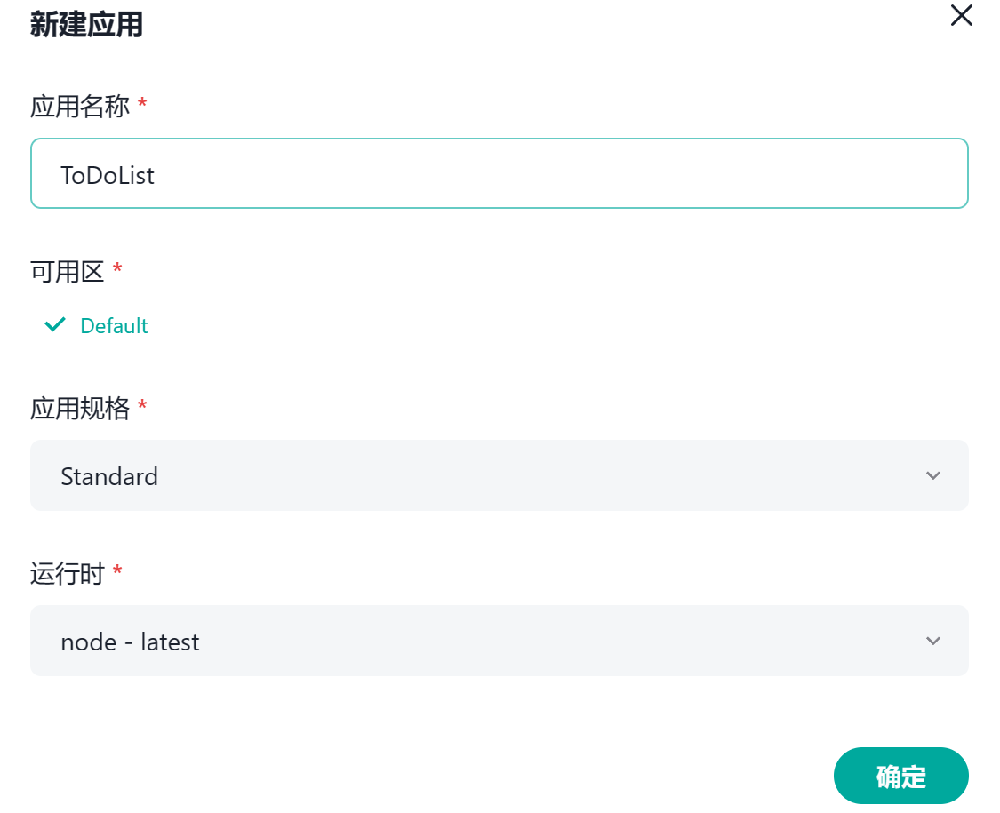
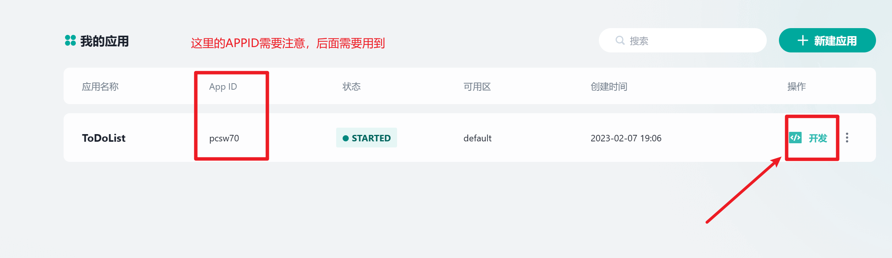
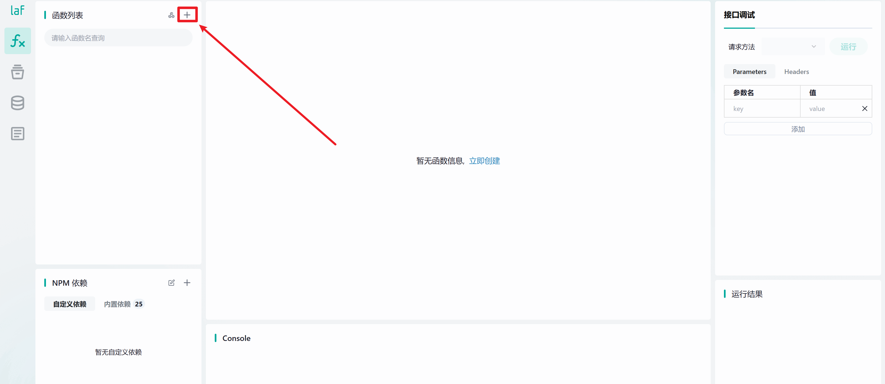
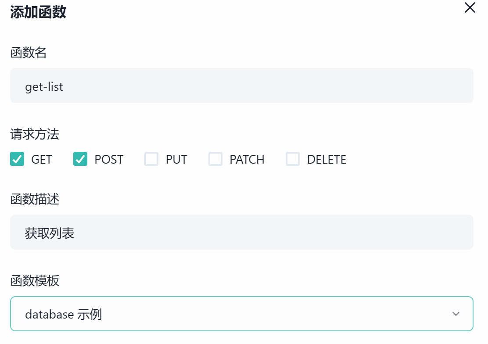
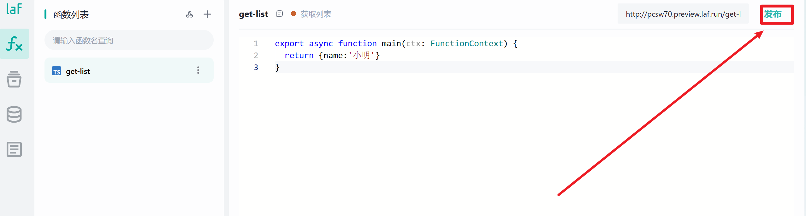
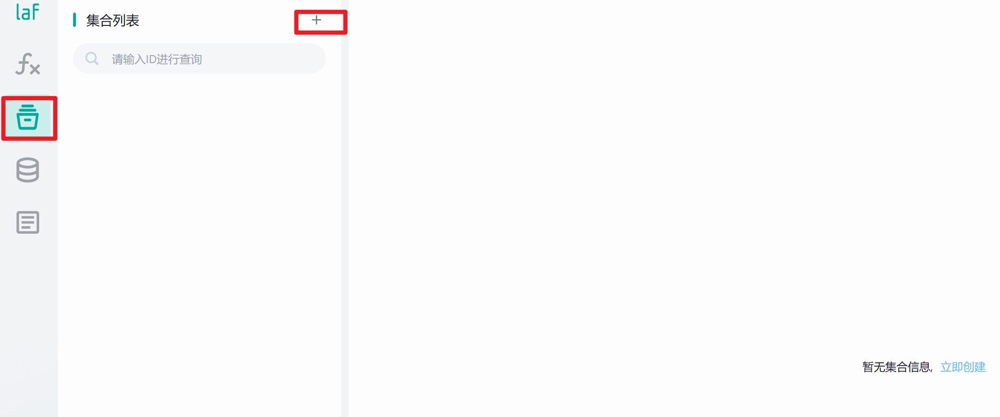
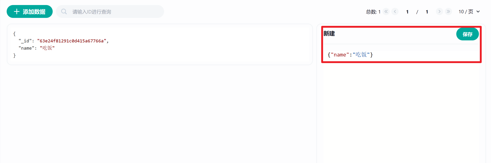
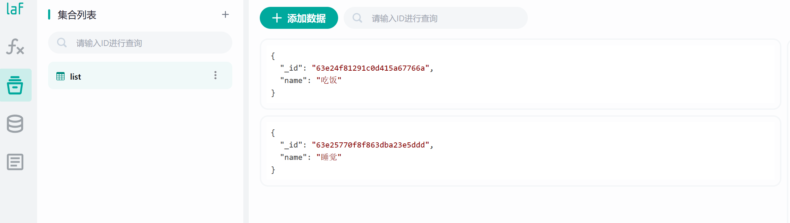
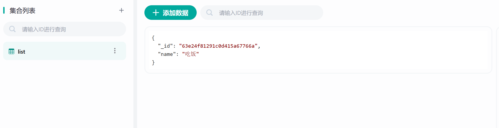

# 三分钟学会 laf
## laf 是什么
- laf 是云开发平台，可以快速的开发应用
- laf 是一个开源的 BaaS 开发平台（Backend as a Service)
- laf 是一个开箱即用的 serverless 开发平台
- laf 是一个集「函数计算」、「数据库」、「对象存储」等于一身的一站式开发平台
- laf 可以是开源版的腾讯云开发、开源版的 Google Firebase    
- **一句话总结，可以让前端秒变全栈。点击[这里](https://github.com/labring/laf)去 Github 查看。**

## 起步
话不多说开始正题，做一个 ToDoList。  
第一步 去 https://laf.dev/ 注册一个账号   
第二步 像我这样创建一个应用   
   
第三步 点击开发按钮进入开发页面   
   


## 云函数
   
我们新建一个函数，这个函数就是我们要写的接口。  
   
在函数中写上以下代码`return`一个对象出去。
```js
export async function main(ctx: FunctionContext) {
  return {name:'小明'}
} 
```
然后点击右上角`发布`按钮。
   
完成这些步骤后，我们在前端项目中调用一下试试看。  
在前端项目安装 laf。
```
  npm install laf-client-sdk
```
vue 页面中使用
```js
import { Cloud } from "laf-client-sdk"; // 引入laf

// 创建cloud对象
const cloud = new Cloud({
  baseUrl: "http://pcsw70.laf.dev", // 这里的pcsw70需要换成自己的APPID
  getAccessToken: () => '', // 这里暂时用不到先为空
});
 
 // 通过 cloud.invoke 调用云函数，参数就是云函数的名字。
const res = await cloud.invoke('get-list')
console.log(res) // {name:'小明'}  这里正是我们云函数get-list返回的对象
```
至此，我们的第一个接口就调通了，我们来总结一下。   
- 创建一个应用。
- 在应用内部创建云函数，把想要给前端的数据`return`出去。
- 在前端项目引入`laf`，创建`cloud对象`，使用`cloud.invoke`调用云函数获取到数据。


## 集合
下面我们来看看数据存放在哪里。   
进入集合页面，创建一个集合。
   
给集合新增一条数据。  
   


## 联合起来
回到我们的`get-list`云函数，让我们通过云函数来查询一下集合中的内容。    
编写以下代码,并且点发布哦。   
```js
import cloud from '@lafjs/cloud' // 引入cloud对象

const db = cloud.database() // 创建数据库对象

export async function main(ctx: FunctionContext) {
  // 从我们刚刚创建的list集合中获取数据
  const res = await db.collection('list').get()

  return res.data
}
```
然后在前端项目中调用。
```js
import { Cloud } from "laf-client-sdk"; // 引入laf

// 创建cloud对象
const cloud = new Cloud({
  baseUrl: "https://pcsw70.laf.dev", // 这里的pcsw70需要换成自己的APPID   
  getAccessToken: () => '', // 这里暂时用不到先为空
});
 
 // 通过 cloud.invoke 调用云函数，参数就是云函数的名字。
const res = await cloud.invoke('get-list')
console.log(res) // [{name: "吃饭",_id: "63e24f81291c0d415a67766a"}]
```
成功查询到集合内的数据，我们继续写增加和删除操作云函数。    
创建云函数`add-item`并写入以下代码。   
```js
import cloud from '@lafjs/cloud'

const db = cloud.database()

export async function main(ctx: FunctionContext) {
  // 调用云函数传入的参数放在ctx.body 里面
  const data = ctx.body
  // 为list集合添加一条数据，data要求是一个对象
  const res = await db.collection('list').add(data)
  // res.ok 为true时操作成功，false时为失败
  return res.ok
}
```
在前端调用
```js
import { Cloud } from "laf-client-sdk";

const cloud = new Cloud({
  baseUrl: "http://pcsw70.laf.dev",
  getAccessToken: () => '',
});

add()
async function add() {
  // invoke的第二个参数就是云函数的参数 对应ctx.body
  await cloud.invoke('add-item', { name: '睡觉' })
}
```
调用成功后我们会发现list集合中多一条数据。
   

创建云函数`delete-item`并写入以下代码。   
```js
import cloud from '@lafjs/cloud'

const db = cloud.database()

export async function main(ctx: FunctionContext) {
  // 前端调用云函数传入的参数放在ctx.body 里面 我们拿到需要删除数据的id
  const { id } = ctx.body
  // list集合中删除一条数据，条件是 _id 的值等于前端传来的id
  const res = await db.collection('list').where({ _id: id }).remove()
  // res.ok 为true时操作成功，false时为失败
  return res.ok
}
```
在前端调用
```js
import { Cloud } from "laf-client-sdk";

const cloud = new Cloud({
  baseUrl: "http://pcsw70.laf.dev",
  getAccessToken: () => '',
});

remove()
async function remove() {
  await cloud.invoke('delete-item', { id: '63e25770f8f863dba23e5ddd' })
}
```
调用成功后我们会发现list集合中删除一条数据。
   
:::tip
更多操作请查看官方文档
:::

## ToDoList 成品
然后把刚刚的这些技能组合起来，稍微加亿点细节就是一个 ToDoList 啦。

```vue
<script setup>
import { Cloud } from "laf-client-sdk";
import { ref } from "vue";

const cloud = new Cloud({
  baseUrl: "http://pcsw70.laf.dev",
  getAccessToken: () => '',
});

// =====================================data=====================================
const list = ref([])
const value = ref('')

// =====================================function=====================================
getList()

async function getList() {
  const res = await cloud.invoke('get-list')
  list.value = res
}

async function add() {
  const res = await cloud.invoke('add-item', { name: value.value })
  if (res) {
    value.value = ''
    getList()
  }
}

async function remove(id) {
  const res = await cloud.invoke('delete-item', { id })
  if (res) getList()
}
</script>

<template>
  <div class="box">
    <input v-model="value" type="text">
    <button class="addButton" @click="add">添加</button>
    <ul>
      <div class="itemBox" v-for="item in list" :key="item._id">
        <li class="itemName">{{ item.name }}</li>
        <button @click="remove(item._id)">移除</button>
      </div>
    </ul>
  </div>
</template>

<style  scoped>
.box {
  margin: 10% 0 0 40%;
  width: 100%;
}

.addButton {
  margin-left: 10px;
}

.itemBox {
  display: flex;
  margin-top: 10px;
}

.itemName {
  width: 100px;
}
</style>

```
---
> 如果本文对你有帮助，可以去 Github 给我的博客点个 star 嘛    
> **https://github.com/zuoFeng59556/my-blog**