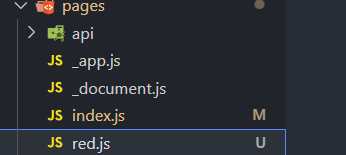

# Next.js
## 起步
**Next.js 能干啥？**
- Compiling ： 把我们写的 `jsx` `TS` 等编译成浏览器认识的 `js`。
- Minifying ： 把代码里的 缩进 空格 换行 删掉，减少文件大小来提高性能。
- Bundling  ： 把多个文件打包组合成更少的文件。
- Code Splitting ：把代码按需分成小块，通过只加载需要的部分来减少加载时间。
- Rendering ：支持服务端渲染直接发送 `html` 文件到浏览器，提升渲染速度。

。。。来点更直接的，`Next.js` 是 `react` 的一个框架，提供了很多方便的功能。   

以下命令创建一个 `next` 项目。
```
npx create-next-app@latest
```
用 vscode 打开并清空 `src/pages/index.js` 和 `src/styles/globals.css`  
然后在 `index.js` 中贴入以下代码。
```js
export default function Home() {
  return (
    <>
      <h1>你好,next</h1>
    </>
  )
}
```
`npm run dev` 启动项目，打开 localhost:3000 
  

## 快速刷新
更改 next 为 小明 就会发现浏览器视图已经更新，无需手动刷新，这就是快速刷新。
```js
export default function Home() {
  return (
    <>
      <h1>你好,小明</h1>
    </>
  )
}
```

## 路由
我们在 `pages` 里面新建一个文件夹 `red.js`
  
写入以下代码
```js
export default function Red() {
  return (
    <>
      <h1>我是小红</h1>
    </>
  )
}
```
浏览器访问 localhost:3000/red 
  
哦吼，这就是路由，总结一下
- 无需额外配置路由，`pages` 下的文件名即是路由`url`
- 但是记得要默认导出 `export default`
- `pages/index.js` 默认路径 `/` 也就是首页
- 访问`pages/login/index.js` 就是 localhost:3000/login/index
***
下面看看如何跳转,贴入一下代码, 点击就会跳转到 localhost:3000/red
```js
import Router from "next/router" // 引入 router

export default function Home() {

  function goto() {
    Router.push('/red')  // Router.push 中传入url
  }

  return (
    <>
      <h1 onClick={goto}>你好,小明</h1>
    </>
  )
}
```
如果想要传参数, 按照以下格式   
`index.js`
```js
import Router from "next/router" // 引入 router

export default function Home() {

  function goto() {
    // 跳转路由并传递参数
    Router.push({ pathname: '/red', query: { name: '小明传来的' } })
  }

  return (
    <>
      <h1 onClick={goto}>你好,小明</h1>
    </>
  )
}
```
接收参数   
`red.js`
```js
import { useRouter } from 'next/router'

export default function Red() {
  // 创建 router 对象
  const router = useRouter()
  return (
    <>
      {/* 接收参数 */}
      <h1>{router.query.name}</h1>
    </>
  )
}
```
因为想先先写别的，所以这个先搁置。。。。。
