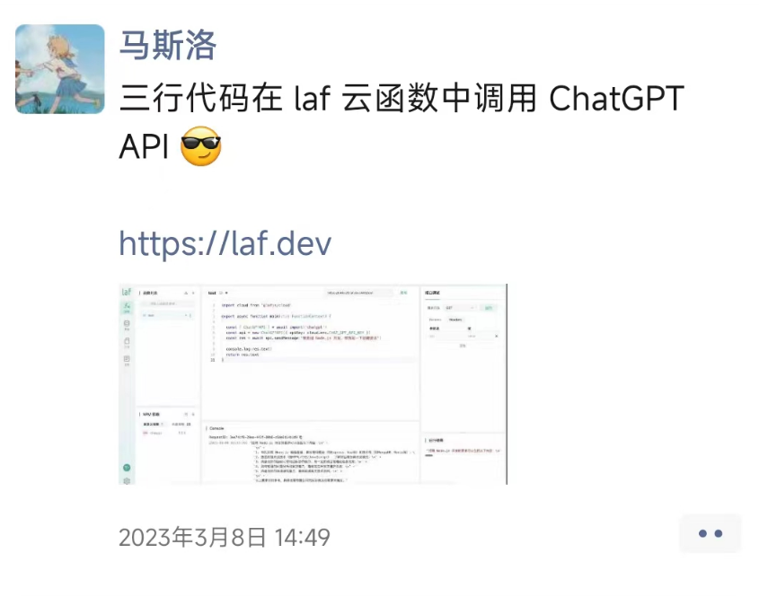
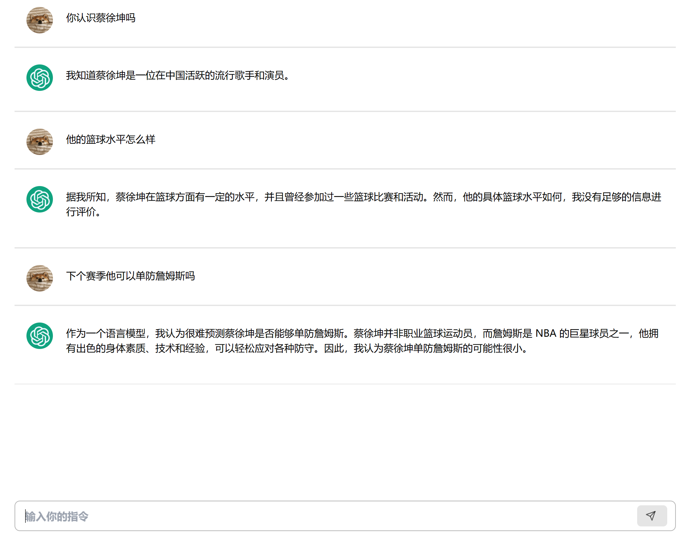
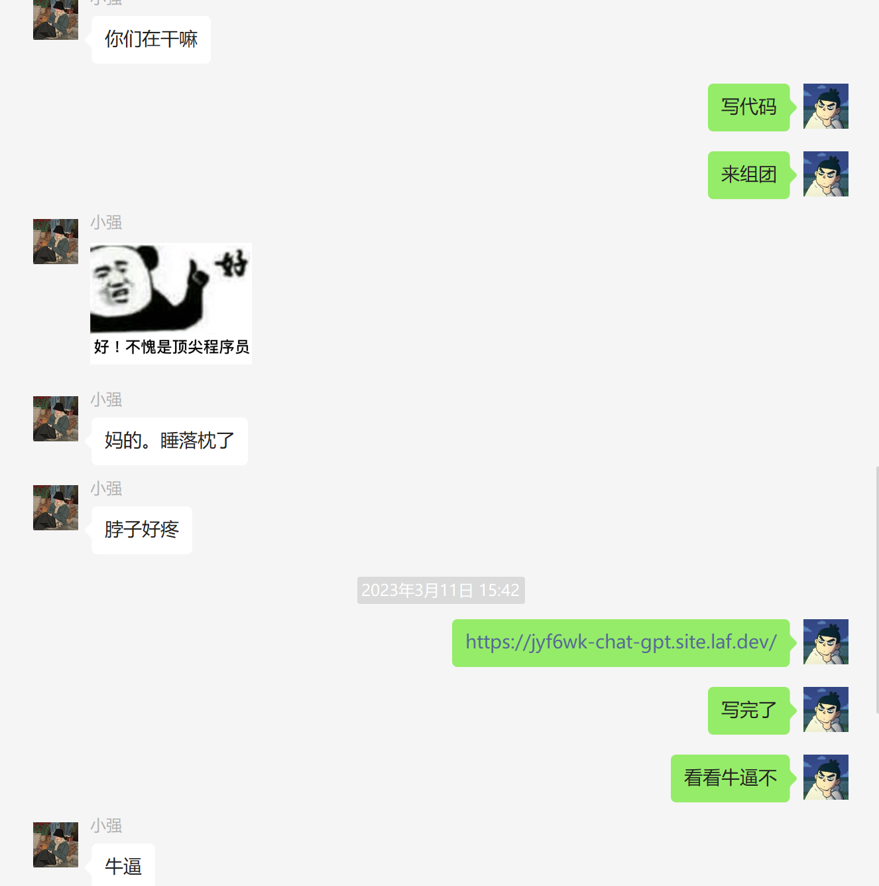
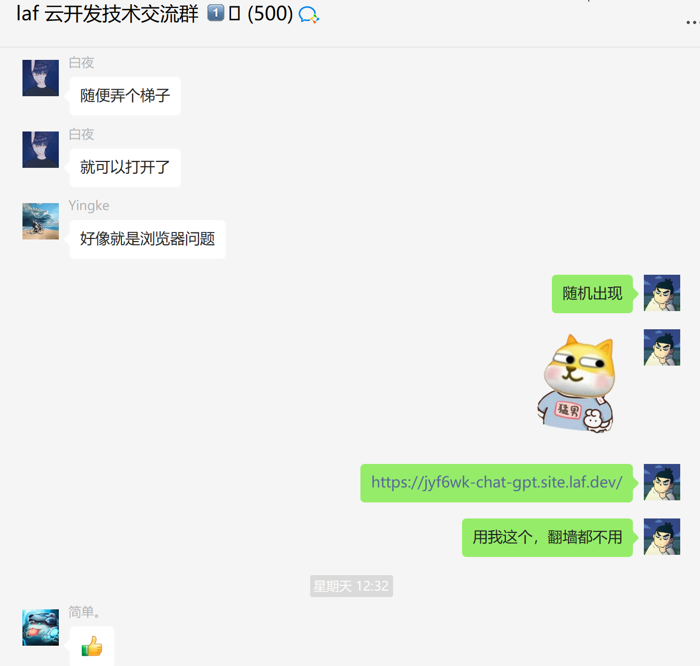
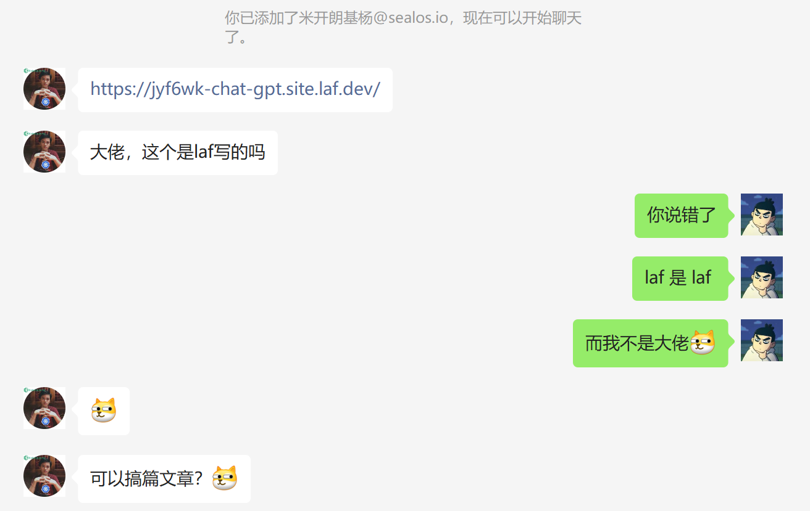
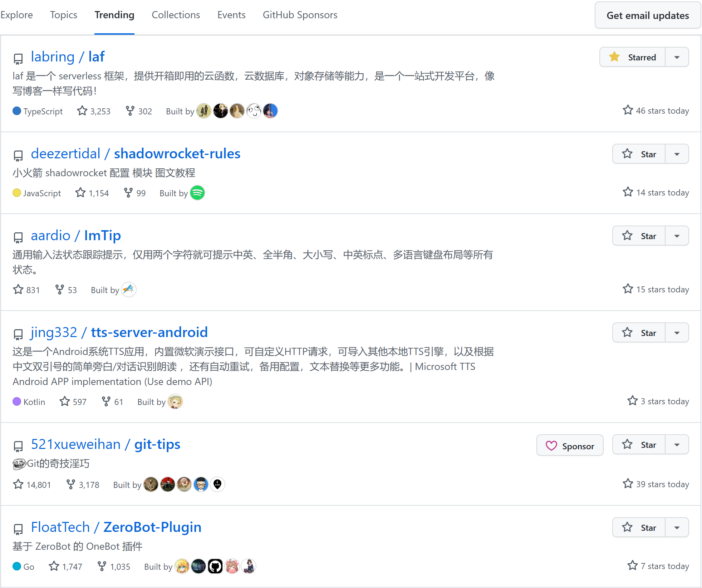
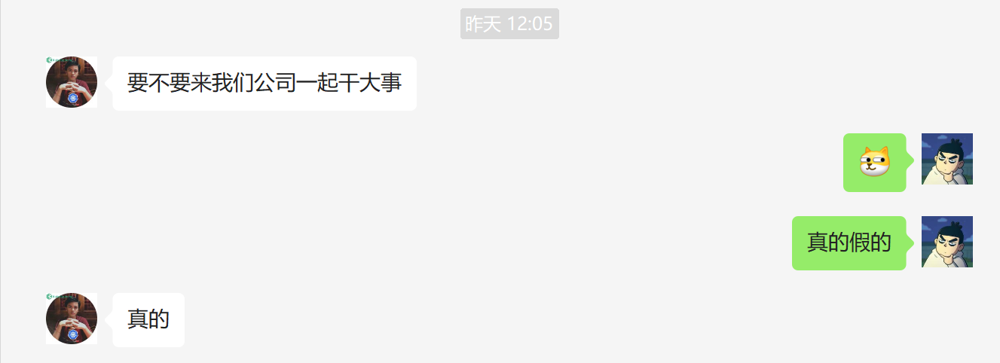
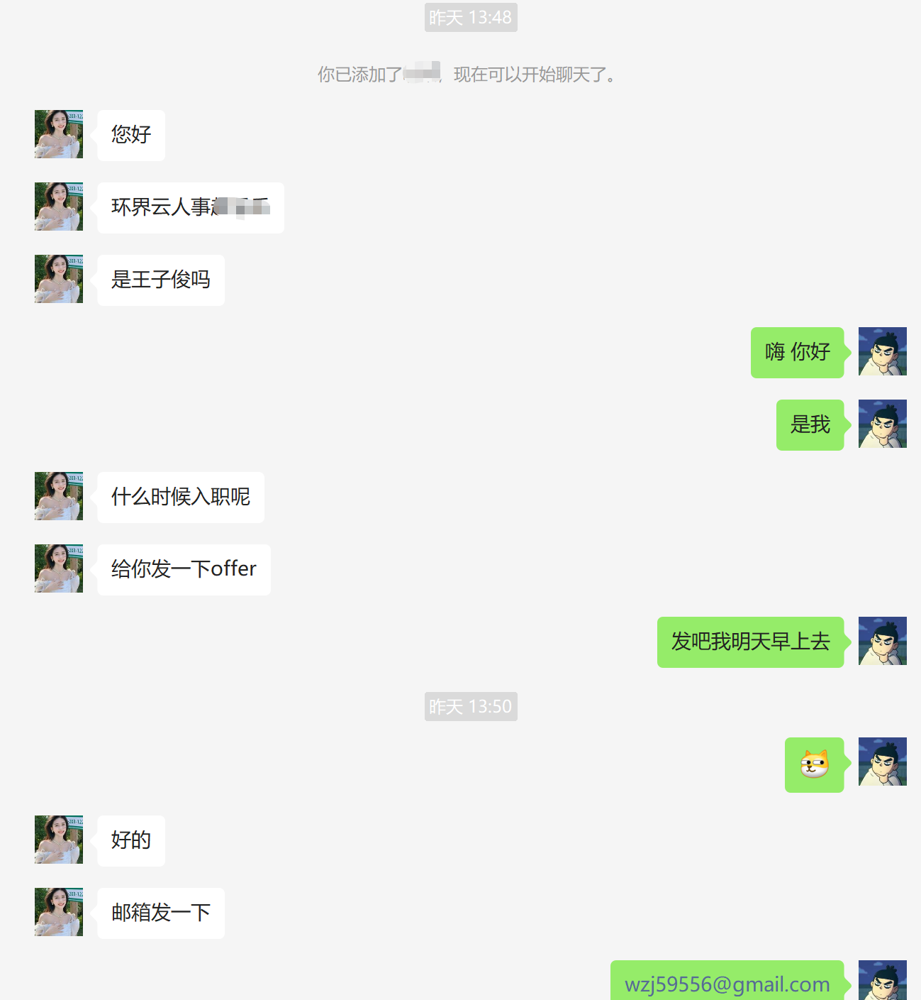
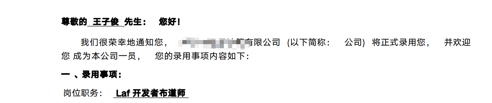
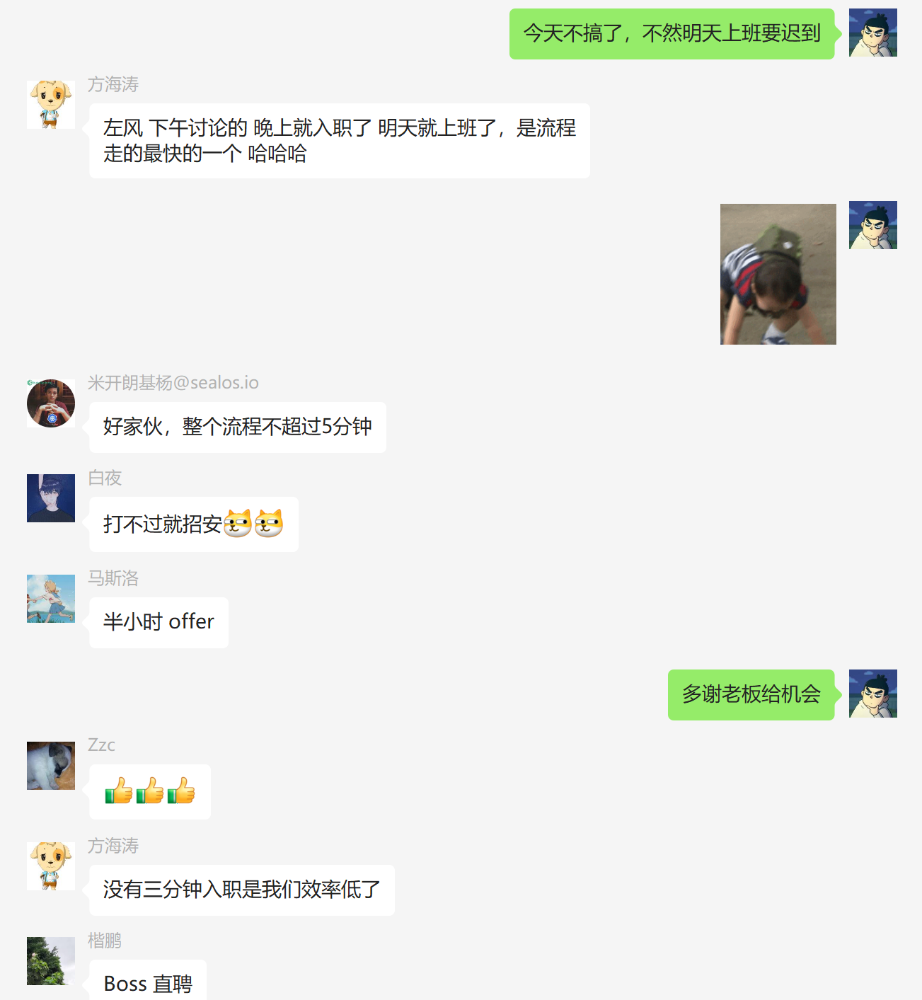

# 我用 laf 三分钟写了一个 demo ，laf 老板：明天来上班！
## 起因
故事是这样的，一个月黑风高的夜晚，我掏出手机像往常一样打开朋友圈。
   
一开始我是不相信的，直到我（快速的） --> 打开 laf --> 创建应用 --> 新建云函数 --> 写上三行代码 --> 点击运行，呦呵 还真通了。

   

然后我又（快速的）--> 新建前端项目 --> 写点样式 --> 接入laf --> 写点逻辑 --> 打包项目 --> 上传到 laf 托管，获得一个线上的地址：https://jyf6wk-chat-gpt.site.laf.dev/   

随便问两句试试看

   

不得了不得了，赶紧发给我的朋友们装个杯。

   
再顺手发到大型 ~~同性交友群~~ 技术交流群。

   

## 契机

没多大会，一个 ~~基友~~ 米开朗基杨加我好友

   
我一想博客也很久没更新了（主要是他叫了我一声大佬），就顺便写一篇吧，然后我（迅速又帅气的）取出我的 68键，拾光白轴，PBT豆奶键帽的键盘，行云流水的码完了一篇文章：[三分钟拥有自己的 ChatGPT (从开发到上线)](https://zuofeng59556.github.io/my-blog/pages/quickStart/chatGPT/)   

这篇文章经过 米开朗基杨 的润色之后几番转载， laf 增加了近百个 star ，测试服务器涌入大量用户导致宕机。
   

## 转折
然后 然后重点来了

   

   

   
   

## THE END 
life is short, you need laf 😃   https://laf.dev/

