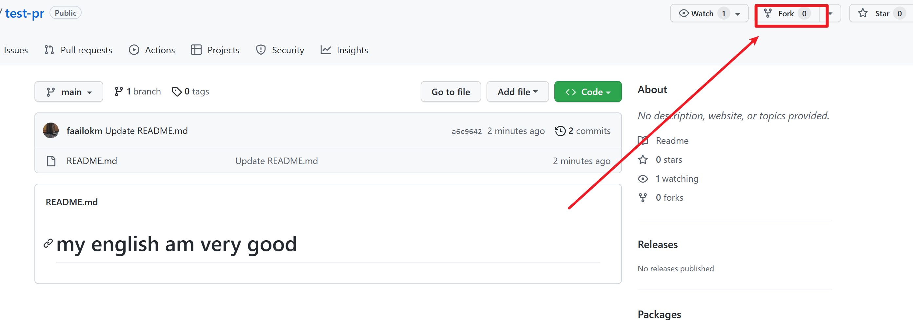
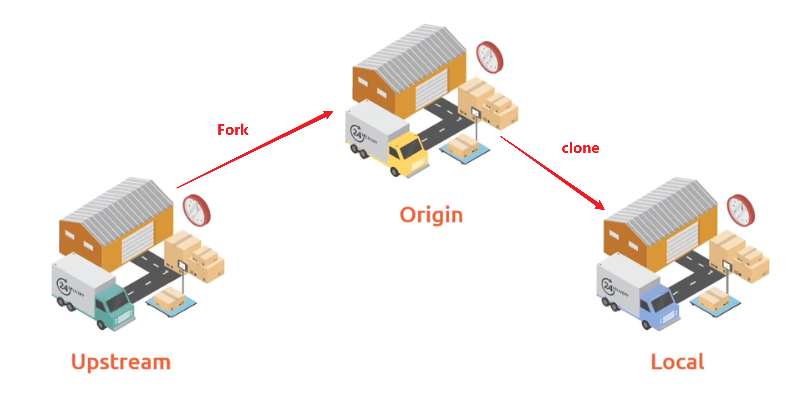
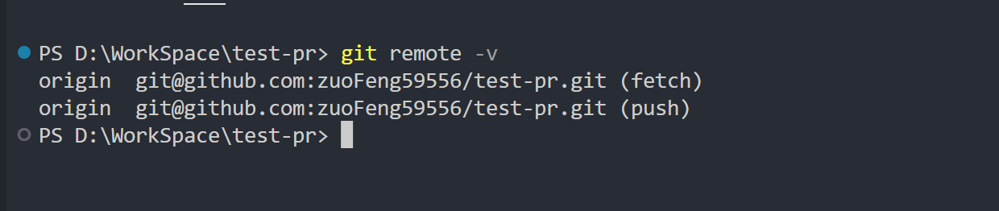
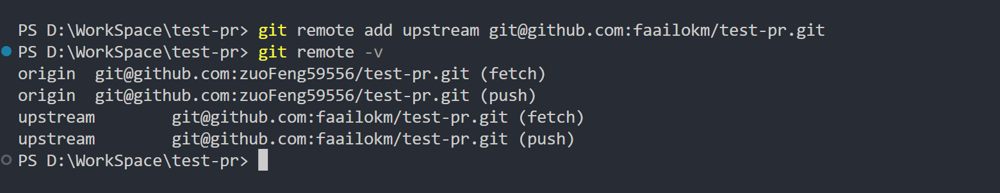
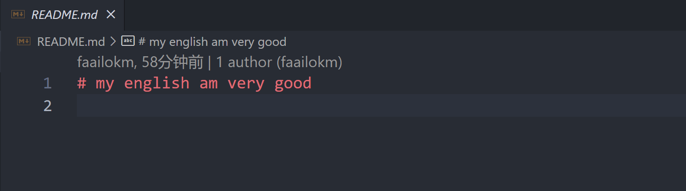
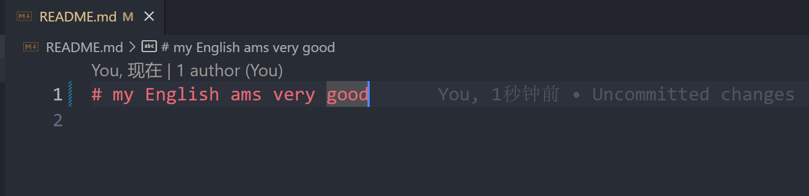
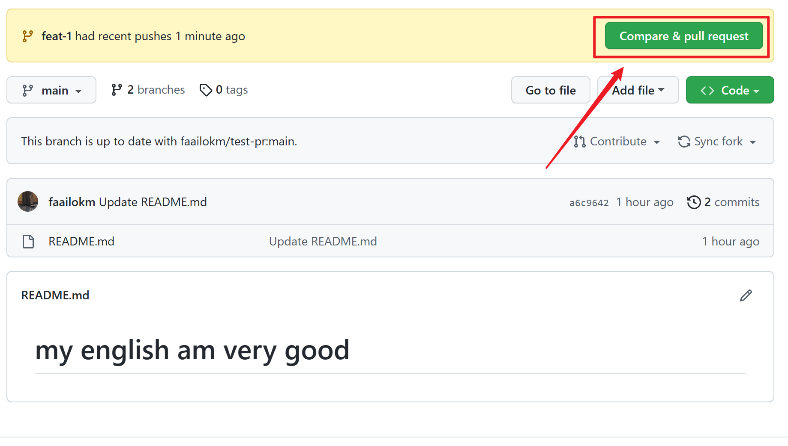
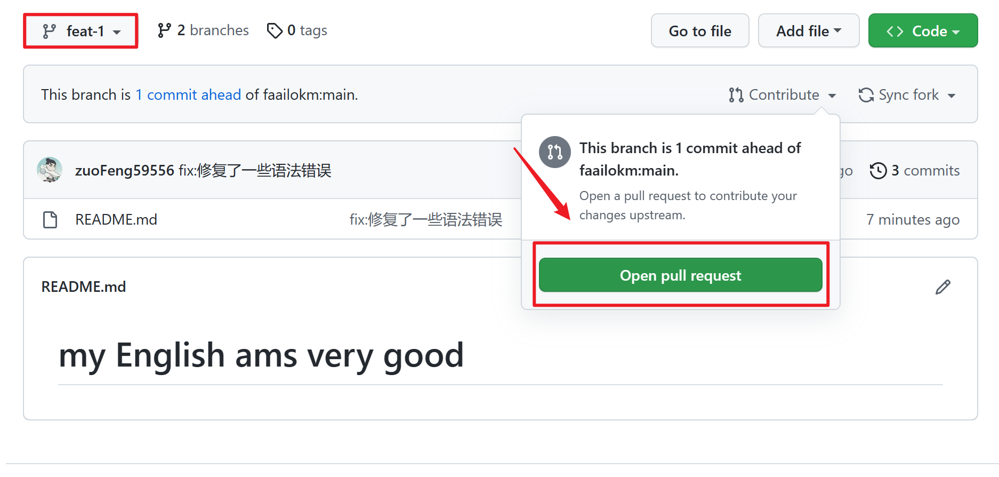
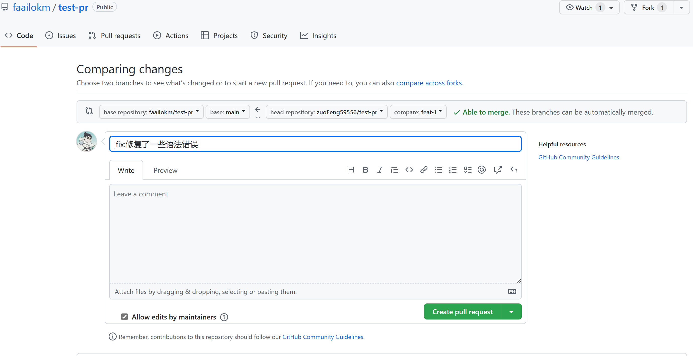
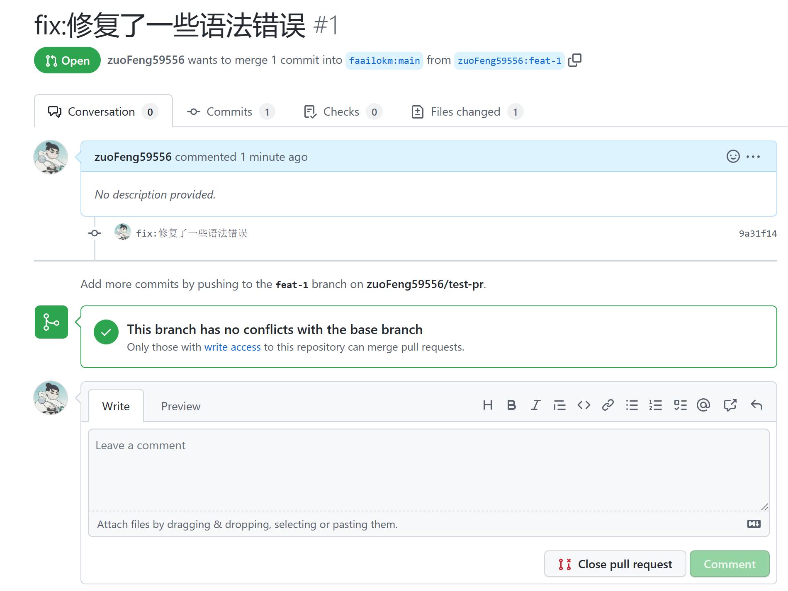

# 三分钟学会参与开源，提交 pr
## pr 是什么
**假设：**
- 你在 GitHub 上发现了一个开源项目。
- 觉得项目中有 bug,或者写的不够好。
- 你想出手帮帮他。 
- 这个时候就会用到 pr (pull request)。
- 这里翻译为： 我改了你的代码，你快来看看把！

## 项目克隆到本地
首先找到一个项目，点击右上角的 Fork 按钮，把项目复制一份到自己的 GitHub。   
   
Fork 完之后我们到自己的仓库列表，找到刚刚复制的仓库，并 clone 到自己本地。
:::tip
这里要注意，一定是 clone 自己复制的那一份哦，而不是原仓库，没有人会让你直接更改别人代码的。
:::

在正式改代码之前我们还需要了解一下仓库的关系。   
我们现在拥有三份代码，称为三个仓库。
- 原作者 GitHub 上的仓库称为 `upstream`
- Fork 复制到我们自己 GitHub 上的称为 `origin`
- 从我们自己 GitHub 上 clone 到本地的称为 `local`
   

在我们项目目录下执行 `git remote -v` 发现只有`origin`仓库。
   
这里用 `git remote add upstream 原仓库地址` 来添加`upstream`仓库。    
再次 `git remote -v` 查看添加成功。
   
至此，我们三个仓库就都关联上了。


## 改代码
改别人代码之前我们还需要做一件事情，那就是从 `upstream` 仓库拉一下最新代码到 `local`，万一别人这会更改了代码呢。   
依次执行以下命令。
```
// 获取到 upstream 仓库
git fetch upstream 

// 切换到主分支
git checkout main 

// 将上游仓库的main分支合并到当前所在分支也就是本地的main分支
git rebase upstream/main 
```
本身到这一步我们已经可以开始修改代码了，但是一个分支在同一时间只能提交一个 pr 如果你有两个 pr 需要提交呢，所以一般建议创建一个分支来修改代码。
```
// 创建一个 feat-1 分支并切换到 feat-1 
git checkout -b feat-1 
```
好了终于可以修改代码了，我们打开项目里仅有的 `readme`  文件，发现这里至少有两处错误，该大写的没大写，也不懂的使用三单。
   
经过我们一番修改后，看起来没有什么问题了。
   

## 提交
然后我们提交代码。
```
git add .
git commit -m 'fix:修复了一些语法错误'
// 这里要指明提交 仓库和分支
git push -u origin feat-1
```
提交成功后，打开 GitHub 我们 Fork 的仓库发现已经有提示了，我们点击右侧绿色按钮。
   
如果你没有看到提示，切换到我们刚刚提交的分支，点击这里进入。
   
总之我们进入到这个页面，按照项目要求填写标题和描述，点击右下角 `Create pull request`，来创建 pr。
   
提交后看到这个页面，就说明我们的 pr 已经提交成功了，等作者合并你的 pr 你就成为这个项目的 contributor 啦。
   

## 总结
- Fork 到自己GitHub
- clone 到本地
- 添加 upstream 仓库
- 更新代码到local
- 创建分支
- 写代码
- 提交代码到 origin
- 创建 pr
- 成为 contributor

:::tip
同一个仓库第二次提 pr 从更新代码到 local 开始就可以啦
:::