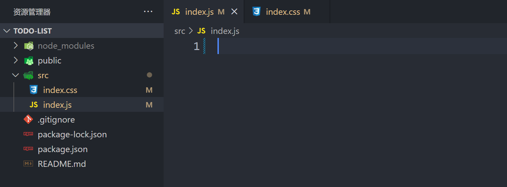

# 三分钟学会 react,实现一个 ToDoList。
## 起步
运行命令创建一个 `react` 项目。
```
npx create-react-app todo-list
```
等待创建完毕后用 `vscode` 打开此项目。
- 删除 src 下面多余文件，只保留 `index.js` 和 `index.css`
- 清空 `index.js` 和 `index.css`   
  
复制以下代码到 `index.js`
```js
import ReactDOM from 'react-dom/client';

// 创建根节点
const root = ReactDOM.createRoot(document.getElementById('root'));

// 渲染
root.render(<h1>你好,react</h1>); 
```
在项目目录下执行 `npm run start`。   
访问 localhost:3000 ，就可以看到我们的内容啦。
  


## JSX
刚刚这段代码在 `js` 中使用了 `html`,这就是 `JSX`,简单理解为 `js` 中可以使用 `html` 而 `html` 中也可以使用 `js`。
```js
root.render(<h1>你好,react</h1>); 
```
示例
```js
import ReactDOM from 'react-dom/client';

const root = ReactDOM.createRoot(document.getElementById('root'));

const name = '小明'
root.render(<h1>你好,{name}</h1>);  //注意是单花括号
```
简单记一下就是，`html` 中使用 `js` 用 `{}`，`js` 中使用 `html` 用 `()`。

## 组件
我们可以用一个函数 `return` 一些 `html` 代码出来，这样看起来更简洁，这个函数就称为组件。
```js
import ReactDOM from 'react-dom/client';

const root = ReactDOM.createRoot(document.getElementById('root'));
root.render(<List></List>);  // 使用组件

const name = '小明'
// 组件名必须大写开头
function List() {
  return (
    // return 出来的组件只能有一个父元素
    <div>
      <h1>你好,{name}</h1>
      <h1>你好,{name}</h1>
      <h1>你好,{name}</h1>
    </div>
  )
}
```
当然组件中也可以嵌套组件
```js
import ReactDOM from 'react-dom/client';

const root = ReactDOM.createRoot(document.getElementById('root'));
root.render(<List></List>);

const name = '小明'

function List() {
  return (
    <div>
      {/* List组件中使用Item组件 */}
      <Item></Item>
      <Item></Item>
      <Item></Item>
    </div>
  )
}

function Item() {
  return (
    <div>
      <h1>你好,{name}</h1>
    </div>
  )
}
```

### props
可以给组件传入一些 `props`。
```js
import ReactDOM from 'react-dom/client';

const root = ReactDOM.createRoot(document.getElementById('root'));
// 传入props
root.render(<List name='小红' age='18' ></List>);

function List(props) {
  return (
    <div>
      {/*  组件中用 props.name 访问 */}
      <h1>你好,{props.name}</h1>
      <h1>你好,{props.age}</h1>
    </div>
  )
}
```

### 事件处理
事件处理使用小驼峰命名，并且不要忘记使用 `js` 的地方需要用 `{}`。
```js
import ReactDOM from 'react-dom/client';

const root = ReactDOM.createRoot(document.getElementById('root'));
root.render(<List></List>);

function List() {

  function ok() {
    console.log('click')
  }

  return (
    <div>
      <h1 onClick={ok}>你好,</h1>
    </div>
  )
}
```

如果我们需要传入参数那么需要用到 `bind`
```js
import ReactDOM from 'react-dom/client';

const root = ReactDOM.createRoot(document.getElementById('root'));
root.render(<List></List>);

function List() {

  function ok(arg) {
    console.log(arg)
  }

  return (
    <div>
      <h1 onClick={ok.bind(this, 'click')}>你好,</h1>
    </div>
  )
}
```
### state
下面我们实现点击改变 `name` 的值，发现控制台输出的 `name` 已经变为小红，而视图没有更新。
```js
import ReactDOM from 'react-dom/client';

const root = ReactDOM.createRoot(document.getElementById('root'));
root.render(<List></List>);

function List() {
  let name = '小明'

  function ok() {
    name = '小红'
    console.log(name); // 小红
  }

  return (
    <div>
      <h1 onClick={ok}>你好,{name}</h1>
    </div>
  )
}
```
为了解决这个问题，我们需要用到 `state`,引入 `useState` 并使用。
```js
import ReactDOM from 'react-dom/client';
import { useState } from 'react'; // 引入 useState

const root = ReactDOM.createRoot(document.getElementById('root'));
root.render(<List></List>);

function List() {
  // name 是属性名 setName是修改属性值时用的函数 
  let [name, setName] = useState('小明')

  function ok() {
    setName("小红") // 修改name的值 视图更新
  }

  return (
    <div>
      <h1 onClick={ok}>你好,{name}</h1>
    </div>
  )
}
```
如果需要修改的值是引用数据类型，则情况有所不同。  
`react` 根据引用地址是否更改变来决定是否更新视图，下面我们用数组来举例子。
```js
import ReactDOM from 'react-dom/client';
import { useState } from 'react';

const root = ReactDOM.createRoot(document.getElementById('root'));
root.render(<List></List>);

function List() {
  const [arr, setArr] = useState(['小明'])

  function ok() {
    setArr(() => {
      // 这里我们需要复制一份新的数组 这样 temp 和 arr 就不会引用同一块内存
      const temp = arr.slice()
      temp[0] = '小红'
      return temp
    })
  }

  return (
    <div>
      <h1 onClick={ok}>你好,{arr[0]}</h1>
    </div>
  )
}
```

## 数组渲染
如果我们有一个数组要渲染到 `html` ,可以利用 `map` 来实现。
```js

import ReactDOM from 'react-dom/client';
import { useState } from 'react';

const root = ReactDOM.createRoot(document.getElementById('root'));
root.render(<List></List>);

function List() {
  const [arr, setArr] = useState(['小明', '小红', '大锤'])

  return (
    <div>
      {arr.map((item, index) => {
        {/* 这里需要给每个item绑定一个唯一的key 我们暂时用index来代替 */}
        return (<h1 key={index}>你好,{item}</h1>)
      })
      }
    </div>
  )
}
```

## css
类名需要用 `className` 来定义，然后我们在 `index.css` 中编写 `css` 代码引入进来。
```js
import ReactDOM from 'react-dom/client';
import { useState } from 'react';
import './index.css' // 引入css文件

const root = ReactDOM.createRoot(document.getElementById('root'));
root.render(<List></List>);

function List() {
  const [arr, setArr] = useState(['小明', '小红', '大锤'])

  return (
    <div>
      {arr.map((item, index) => {
        // 添加类名
        return (<h1 className='title' key={index}>你好,{item}</h1>)
      })
      }
    </div>
  )
}
```
`index.css`
```css
.title {
  color: red;
}
```

到这里我们总结一下。
- `JSX` 在 `html` 中使用 `js` 用 `{}`，`js` 中使用 `html` 用 `()`
- 代码行数过多可以提取组件
- 组件可以嵌套
- 组件可以传入 `props`
- 事件处理和类名用小驼峰命名
- 用`state`实现数据响应，引用数据类型需要另外处理 
- 数组渲染需要用到 `map`

## 完整代码
把上面的技能组合起来，然后再稍微加亿点细节，就是一个 ToDoList 啦！   
`index.js`

```js
import ReactDOM from 'react-dom/client';
import "./index.css"
import { useState } from 'react'

const root = ReactDOM.createRoot(document.getElementById('root'));
root.render(<ToDoList />);

function ToDoList() {
  const [arr, setArr] = useState([])
  const [value, setValue] = useState('')

  function valueChange(e) {
    setValue(e.target.value)
  }

  function add() {
    setArr(() => {
      const arr1 = arr.slice()
      arr1.push(value)
      return arr1
    })
    setValue('')
  }

  function del(index) {
    setArr(() => {
      const arr1 = arr.slice()
      arr1.splice(index, 1)
      return arr1
    })
  }

  return (
    <div className='box'>
      <input className='input' value={value} onChange={valueChange} type="text" />
      <button onClick={add} >添加</button>
      {arr.map((item, index) => { return <Item key={index} index={index} name={item} del={del} ></Item> })}
    </div>
  )
}

function Item(props) {
  return (
    <ul>
      <div className='item'>
        <li className='name'>{props.name}</li>
        <button onClick={props.del.bind(this, props.index)} >删除</button>
      </div>
    </ul>
  )
}
```
`index.css`
```css
.box {
  margin: 10% 0 0 40%;
}

.input {
  margin-right: 10px;
}

.item {
  display: flex;
}

.name {
  width: 100px;
}
```
---
> 如果本文对你有帮助，可以去 Github 给我的博客点个 star 嘛    
> **https://github.com/zuoFeng59556/my-blog**