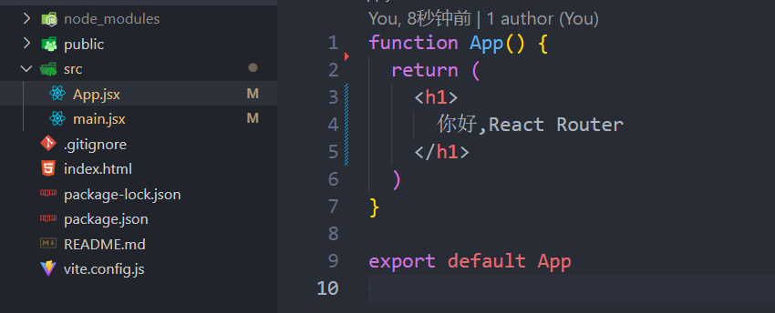
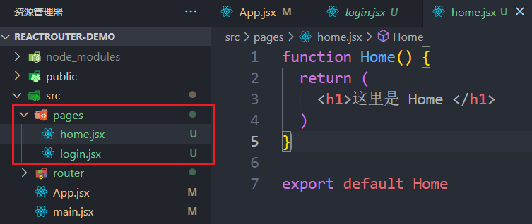
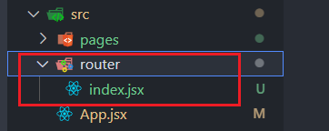
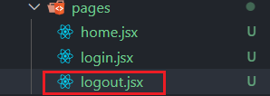

# 三分钟学会 React Router
## 起步
首先创建一个项目 并安装 `react-router`
```js
npm create vite reactRouter-demo --template react
cd .\reactRouter-demo\
npm install react-router-dom
```
用 vscode 打开并清空 `src` 文件夹 只保留 `APP.jsx` 和 `main.jsx`   
  
在 App.jsx 中写入以下代码
```js
function App() {
  return (
    <h1>
      你好,React Router
    </h1>
  )
}

export default App
```
然后 
```
npm i 
npm run dev
```
  

## 配置路由
src 文件下创建 pages 文件夹   
然后在 pages 文件下创建 home.jsx 和  login.jsx 
  
并写入以下代码   
`home.jsx`
```js
function Home() {
  return (
    <h1>这里是 Home </h1>
  )
}
export default Home
```
`login.jsx`
```js
function Login() {
  return (
    <h1>这里是 Login</h1>
  )
}
export default Login
```

src下再创建一个 router 文件夹 并创建 index.jsx 文件
  
写入以下代码   
`index.jsx`
```js
import Login from "../pages/login" 
import Home from "../pages/home"

const routes = [ 
  {
    path: "/", // 这里的斜杠代表首页
    element: <Home />
  },
  {
    path: "/login",
    element: <Login />
  }
]
export default routes
```

做完这些之后，我们修改一下 App.jsx 中的内容
```js
import { BrowserRouter, useRoutes } from "react-router-dom";
import routes from "./router"; 

function RouteElement() {
  const element = useRoutes(routes);
  return element;
}

function App() {
  return (
    <>
      <BrowserRouter>
        <RouteElement />
      </BrowserRouter>
    </>
  )
}
export default App

```
用浏览器访问项目的运行地址(我这里是 127.0.0.1:5173 )，就会发现
  
继续访问 127.0.0.1:5173/login
  

这样我们就完成了路由的基础配置，如果我们想添加新的页面，只需以下操作
- pages 文件夹下创建 对应的文件 写完代码后默认导出
- 在 router/index.jsx 中引入
- 在 router/index.jsx 的 routes 新增一个对象 path 路径名 element 引入的组件
- 在项目运行地址后 加上刚刚设置的 path 即可访问

## 跳转
路由跳转我们需要用到 `useNavigate` , 我们在 home.jsx 中写入以下代码，点击按钮即可跳转到 login 页面。   
`home.jsx`
```js
import { useNavigate } from 'react-router-dom' // 引入

function Home() {
  // 创建跳转函数
  const navigate = useNavigate() 
  
  function goToLogin() {
    // 填入对应的路由 path 就是 routes 数组里面的 path
    navigate('/login')
  }

  return (
    <>
      <h1>这里是 Home </h1>
      <button onClick={goToLogin}>点我去 login </button>
    </>
  )
}

export default Home
```
## 传参
如果一个页面需要接收参数，那么我们需要在 path 上预留一个参数占位，例如我们在 login 页面接收一个 id 。   
`router/index.jsx`
```js
import Login from "../pages/login" 
import Home from "../pages/home"

const routes = [ 
  {
    path: "/",
    element: <Home />
  },
  {
    // 路径后面加上 /：参数名
    path: "/login/:id",
    element: <Login />
  },
]
export default routes
```
我们在跳转的时候需要把id带上
```js
// 同样在 path 后面加上需要传递的参数 这里的10086就是我们传的id
navigate('/login/10086')
```
我们在login页面接收一下参数   
`login.jsx`
```js
import { useParams } from 'react-router-dom' // 引入

function Login() {
  const params = useParams() // 创建 params 对象
  return (
    // 使用参数
    <h1>这里是 Login 我的id是{ params.id}</h1>
  )
}
export default Login
```
  

## 嵌套路由
在pages下新建一个文件 logout.jsx 
  
写入以下代码   
`logout.jsx `
```js
function Logout() {
  return (
    <h1>This is Logout </h1>
  )
}
export default Logout
```
然后我们修改一下各个文件的代码   
`router/index.jsx`
```js
import Login from "../pages/login" 
import Logout from "../pages/logout"
import Home from "../pages/home"

const routes = [ 
  {
    path: "/",
    element: <Home />,
    children: [ // 二级路由 配置在一级路由的 children 里
      {
        path: "/login/",
        element: <Login />
      },
      {
        path: "/logout/",
        element: <Logout />
      }
    ]
  }
]
export default routes
```
`home.jsx`
```js
import { useNavigate,Outlet } from 'react-router-dom'

function Home() {
  const navigate = useNavigate() 
  
  function goToLogin() {
    navigate('/login')
  }

  function goToLogout() {
    navigate('/logout')
  }

  return (
    <>
      <h1>这里是 Home </h1>
      <button onClick={goToLogin}>show login </button>
      <button onClick={goToLogout}>show logout </button>
      {/* 这里的 Outlet 是二级路由的出口 也就是渲染的地方 */}
      <Outlet/>
    </>
  )
}

export default Home
```
`login.jsx`
```js
function Login() {
  return (
    <h1>这里是 Login </h1>
  )
}
export default Login
```
改完以后我们访问项目运行地址  127.0.0.1:5173 注意访问的是首页哦

  
***
**点击左侧 show login 按钮**
  
***
**点击右侧 show logout 按钮**
  

我们发现 home 页面中使用了 login  logout 两个页面，可以通过路由跳转切换，这就是嵌套路由。   
使用嵌套路由需要
- 在一级路由中添加属性 `children` 并把二级路由配置进入
- 页面引入 `Outlet` 作为出口
- 跳转即可

## 404路由
在 pages 里新建一个文件 NotFound.jsx 并写上以下代码   
`NotFound.jsx`
```js
function NotFound() {
  return <h1>这里什么都没有哦</h1>
}
export default NotFound
```
在 router/index.jsx 中引入并添加到 routes   
`router/index.jsx`
```js
import Login from "../pages/login" 
import Logout from "../pages/logout"
import Home from "../pages/home"
import NotFound from "../pages/NotFound" // 引入
const routes = [ 
  {
    path: "/",
    element: <Home />,
    children: [ 
      {
        path: "/login/",
        element: <Login />
      },
      {
        path: "/logout/",
        element: <Logout />
      }
    ]
  },
  {
    // 路径设置为 *
    path: "*",
    element: <NotFound />,
  }
]
export default routes
```

然后随便访问一个不存在的路径 例如 127.0.0.1:5173/my 发现
  

**ok 恭喜我们已经学会了 React Router**