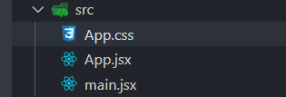
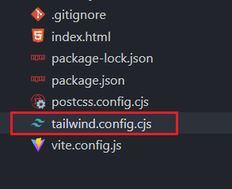
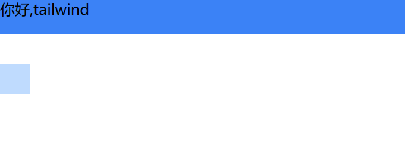
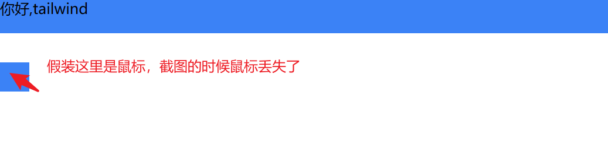
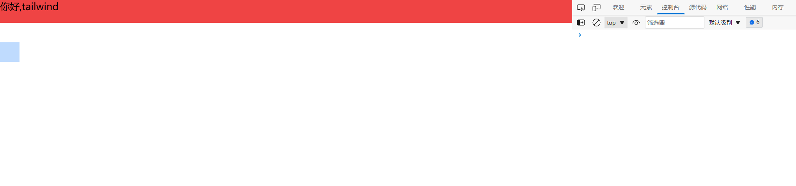
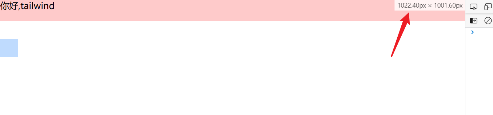
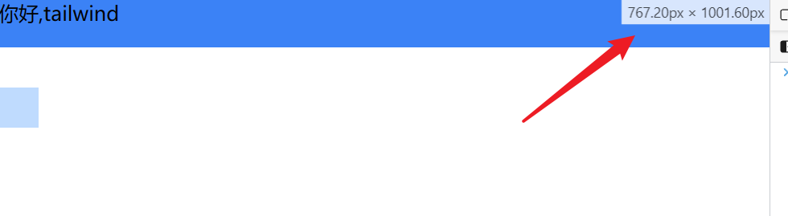
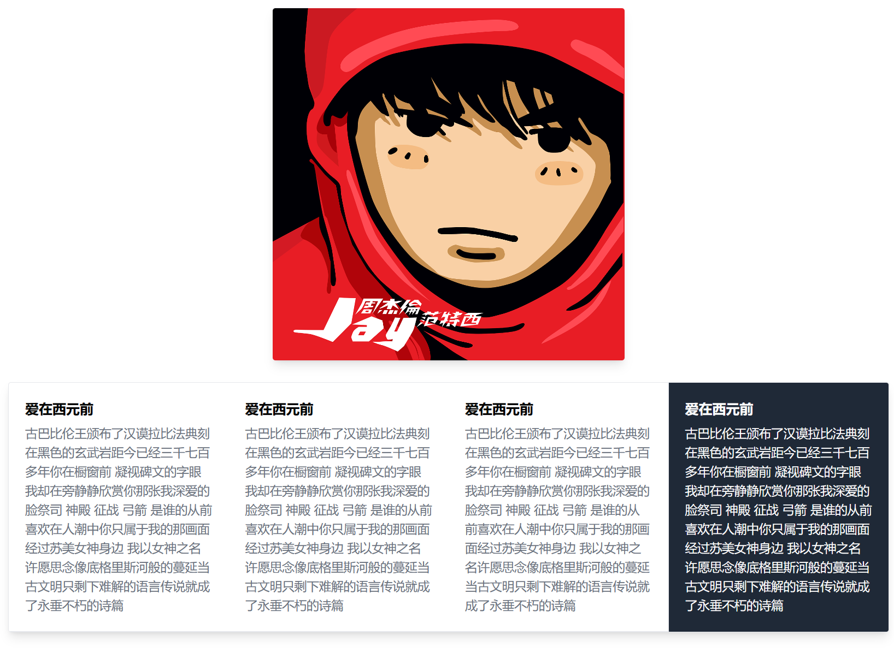

# 三分钟学会 tailwind 和 Css 说拜拜
## 起步
老规矩创建一个项目用 `vscode` 打开
```
npm create vite tailwind-demo --template react
cd tailwind-demo
code .
```
打开后删除 `src` 下的其他文件夹，只保留 `App.jsx` `App.css` 和 `main.jsx`
   

写入以下代码   
`App.jsx`
```js
import "./App.css";

function App() {
  return (
    <>
      <h1>你好,tailwind</h1>
    </>
  )
}

export default App

```
`main.jsx`
```js
import React from 'react'
import ReactDOM from 'react-dom/client'
import App from './App'

ReactDOM.createRoot(document.getElementById('root')).render(
  <React.StrictMode>
    <App />
  </React.StrictMode>,
)

``` 
`App.css` 暂时为空   
依次执行以下命令
```
// 安装项目依赖
npm i
// 安装 tailwind
npm install -D tailwindcss postcss autoprefixer
// 初始化 tailwind 配置文件
npx tailwindcss init -p
```
执行完之后我们会发现项目里生成了两个文件
   
我们打开 `tailwind.config.cjs` 写入以下代码   

```js
/** @type {import('tailwindcss').Config} */
module.exports = {
  content: [
    "./index.html",
    "./src/**/*.{js,ts,jsx,tsx}",
  ],
  theme: {
    extend: {},
  },
  plugins: [],
}
```
然后在 `App.css` 中写入以下代码   

```css
@tailwind base;
@tailwind components;
@tailwind utilities;
```
`npm run dev` 启动项目 打开浏览器会发现
   

耶？ `h1` 变得这么小只，不要慌 这说明 `tailwind` 起作用了

## 初体验
接下来我们改动一下 `App.jsx` 中的代码   

```js
import "./App.css";

function App() {
  return (
    <>
      <div className="text-xl mb-10 h-12 bg-blue-500">你好,tailwind</div>
      <div className="h-10 w-10 bg-blue-200 hover:bg-blue-500"></div>
    </>
  )
}

export default App
```
打开浏览器发现
   
把鼠标放在下面蓝色小方块试试
   
发生了什么？
- 我们只需要写类名就可以实现对应的样式 (对我这种时常不知道起什么类名的特别友好)
- `h` 就是 `height` , `w` 就是 `width` 单位 1 就是 `0.25rem`
- `mb` 就是 `margin-bottom`
- `bg` 就是 `background` 
- `blue-200` 就是 蓝色 `blue-500` 就是更蓝
- `hover:` 就是在鼠标放在上面时显示的样式 

我们继续添加一些代码   
`App.jsx`
```js
import "./App.css";

function App() {
  return (
    <>
      {/*                                            添加的代码在此注释下面 */}
      <div className="text-xl mb-10 h-12 bg-blue-500 md:bg-red-200 lg:bg-red-500">你好,tailwind</div>
      <div className="h-10 w-10 bg-blue-200 hover:bg-blue-500"></div>
    </>
  )
}
export default App
```
这里我们在第一个 `div` 里面添加了 `md:bg-red-200` `lg:bg-red-500`  
现在我们打开浏览器，按 `F12` 把控制台像我这样设置在右侧
   
然后我们缩小页面宽度，当页面宽度缩小为 `1022px` 附近的时候，我们发现第一个 `div` 的背景色变成了淡一些的红色
 
我们继续缩小到 `767px` 附近 背景色又变成了蓝色
 

说到这里，应该也猜出是怎么回事了
- `tailwind` 是移动端优先，所以没有指定前缀的类名默认是在小屏时使用
- `md:` 前缀后的类名是屏幕在中等宽度的时候使用
- `lg:` 前缀后的类名是在屏幕较大的时候使用

## 来点厉害的
**先看一下效果图**    
`小屏`
 

`中屏`
 

`大屏`
 

下面代码稍微有点复杂，这里先说一下思路，做响应式的时候先写最小屏幕的样式，也就是不带前缀的，然后写中等屏幕的`md：`前缀的，最后写大屏`lg：`前缀的，是写完一个屏幕拉大之后调试着写，而不是一把梭。   
这个例子是参考这个视频来做的，如果你感觉不理解，点击[这里](https://www.bilibili.com/video/BV1vU4y1h7M1/?spm_id_from=333.337.search-card.all.click&vd_source=903c2b09b7412037c2eddc6a8fb9828b)查看原视频。   
最后，[官方文档](https://tailwindcss.com/)写的非常清晰，可以一边查阅文档一边写。   
**完整代码**   
`App.jsx`
```js
import "./App.css";

function App() {
  return (
    <>
      <div className="mx-4 my-4">
        
        <div className="my-8 border rounded md:flex md:flex-wrap shadow-lg overflow-hidden">
          
          <div className="p-6 border-b md:w-1/2 md:border-r lg:w-1/4 lg:border-r-0 hover:bg-gray-800 group">
            <h2 className="text-base md:text-lg lg:text-xl font-bold mb-2 group-hover:text-white">爱在西元前</h2>
            <p className="text-sm md:text-base lg:text-lg text-gray-500 group-hover:text-white">古巴比伦王颁布了汉谟拉比法典刻在黑色的玄武岩距今已经三千七百多年你在橱窗前 凝视碑文的字眼我却在旁静静欣赏你那张我深爱的脸祭司 神殿 征战 弓箭 是谁的从前喜欢在人潮中你只属于我的那画面经过苏美女神身边 我以女神之名许愿思念像底格里斯河般的蔓延当古文明只剩下难解的语言传说就成了永垂不朽的诗篇
            </p>
          </div>

          <div className="p-6 border-b md:w-1/2 lg:w-1/4 lg:border-r lg:border-r-0 hover:bg-gray-800 group">
            <h2 className="text-base md:text-lg lg:text-xl font-bold mb-2 group-hover:text-white">爱在西元前</h2>
            <p className="text-sm md:text-base lg:text-lg text-gray-500 group-hover:text-white">古巴比伦王颁布了汉谟拉比法典刻在黑色的玄武岩距今已经三千七百多年你在橱窗前 凝视碑文的字眼我却在旁静静欣赏你那张我深爱的脸祭司 神殿 征战 弓箭 是谁的从前喜欢在人潮中你只属于我的那画面经过苏美女神身边 我以女神之名许愿思念像底格里斯河般的蔓延当古文明只剩下难解的语言传说就成了永垂不朽的诗篇
            </p>
          </div>

          <div className="p-6 border-b md:w-1/2 md:border-r lg:w-1/4 hover:bg-gray-800 group">
            <h2 className="text-base md:text-lg lg:text-xl font-bold mb-2 group-hover:text-white">爱在西元前</h2>
            <p className="text-sm md:text-base lg:text-lg text-gray-500 group-hover:text-white">古巴比伦王颁布了汉谟拉比法典刻在黑色的玄武岩距今已经三千七百多年你在橱窗前 凝视碑文的字眼我却在旁静静欣赏你那张我深爱的脸祭司 神殿 征战 弓箭 是谁的从前喜欢在人潮中你只属于我的那画面经过苏美女神身边 我以女神之名许愿思念像底格里斯河般的蔓延当古文明只剩下难解的语言传说就成了永垂不朽的诗篇
            </p>
          </div>

          <div className="p-6 md:w-1/2 lg:w-1/4 hover:bg-gray-800 group">
            <h2 className="text-base md:text-lg lg:text-xl font-bold mb-2 group-hover:text-white">爱在西元前</h2>
            <p className="text-sm md:text-base lg:text-lg text-gray-500 group-hover:text-white">古巴比伦王颁布了汉谟拉比法典刻在黑色的玄武岩距今已经三千七百多年你在橱窗前 凝视碑文的字眼我却在旁静静欣赏你那张我深爱的脸祭司 神殿 征战 弓箭 是谁的从前喜欢在人潮中你只属于我的那画面经过苏美女神身边 我以女神之名许愿思念像底格里斯河般的蔓延当古文明只剩下难解的语言传说就成了永垂不朽的诗篇
            </p>
          </div>

        </div>
      </div>
    </>
  );
}

export default App;

```
