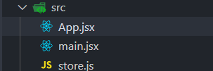
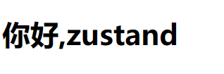
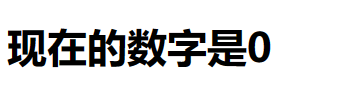
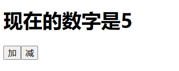
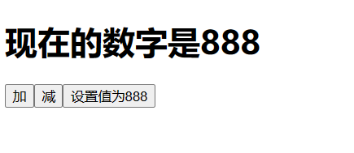
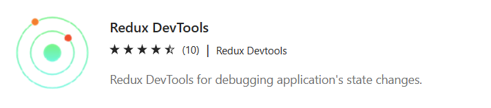
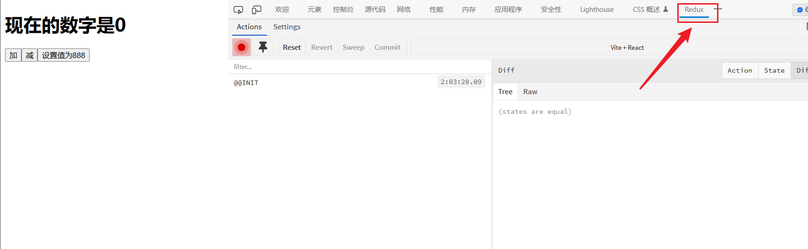
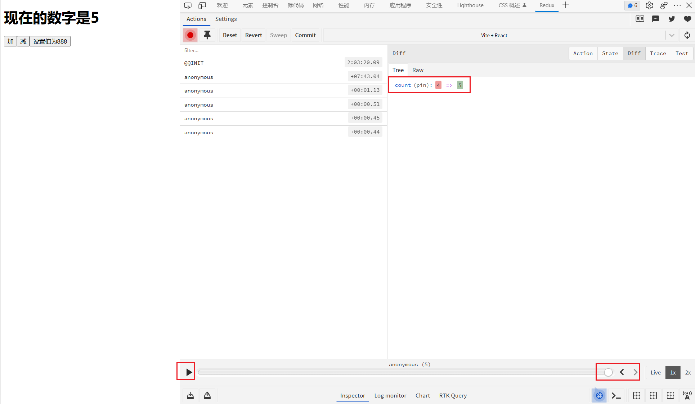

# 三分钟学会 zustand + immer 优雅的管理你的状态
## 起步
老规矩创建一个项目用 `vscode` 打开
```
npm create vite zustand-demo --template react
cd zustand-demo
code .
```
删除 `src` 下多余文件 保留 `App.jsx` `main.jsx` , 并新增一个 `store.js` 
   
 `App.jsx` 中写入以下代码
 ```js
function App() {
  return <><h1>你好,zustand</h1></>;
}

export default App;
 ```
 `main.jsx` 中写入以下代码
 ```js
import React from 'react'
import ReactDOM from 'react-dom/client'
import App from './App'

ReactDOM.createRoot(document.getElementById('root')).render(
  <React.StrictMode>
    <App />
  </React.StrictMode>,
)
 ```

依次执行以下命令
```
npm i
npm install zustand
npm install immer
```
`npm run dev` 启动项目
   

## 配置
打开我们刚创建的 `store.js` 按照以下格式写入
```js
import { create } from "zustand";
import { immer } from 'zustand/middleware/immer'

const useStore = create(
    immer((set) => ({
      count: 0,
    }))
);

export default useStore;
``` 
现在我们创建了一个全局的 `count` 我们可以在任何组件中使用它
## 使用
打开 `App.js` 写入以下代码
```js
import useStore from "./store.js"; // 引入我们创建的 useStore

function App() {
  // 获取到 count
  const count = useStore((state) => state.count);

  return <>
    {/*  使用 */}
    <h1> 现在的数字是{count}</h1>
  </>;
}

export default App;
```
看看效果
   

## 修改
回到 `store.js` 我们为 `count` 添加上增加和减少的方法
```js
import { create } from "zustand";
import { immer } from 'zustand/middleware/immer'

const useStore = create(
    immer((set) => ({
      count: 0,

      // 这里的括号比较多 别少复制了
      addCount() {
        set((state) => {
          state.count = state.count + 1;
        });
      },

      subCount() {
        set((state) => {
          state.count = state.count - 1;
        });
      },

    }))
);

export default useStore;
``` 
在 `App.js` 中使用
```js
import useStore from "./store.js"; 

function App() {
  const count = useStore((state) => state.count);
  // 拿到定义的方法
  const add = useStore((state) => state.addCount);
  const sub = useStore((state) => state.subCount);
  return <>
    <h1> 现在的数字是{count}</h1>
    {/* 使用 */}
    <button onClick={add}>加</button>
    <button onClick={sub}>减</button>
  </>;
}

export default App;
```
现在打开浏览器，随便点点两个按钮就会发现数据在变化
   


## 传参修改
我们同样也可以传入参数修改 `count` 的值   
`store.js`   
```js
import { create } from "zustand";
import { immer } from 'zustand/middleware/immer'

const useStore = create(
    immer((set) => ({
      count: 0,

      addCount() {
        set((state) => {
          state.count = state.count + 1;
        });
      },

      subCount() {
        set((state) => {
          state.count = state.count - 1;
        });
      },
      // 这里我们接收一个参数 value
      setCount(value) {
        set((state) => {
          state.count = value;
        });
      },

    }))
);

export default useStore;
```
在 `App.js` 中传入参数
```js
import useStore from "./store.js";

function App() {
  const count = useStore((state) => state.count);
  const add = useStore((state) => state.addCount);
  const sub = useStore((state) => state.subCount);
  // 拿到方法
  const set = useStore((state) => state.setCount);

  return <>
    <h1> 现在的数字是{count}</h1>
    <button onClick={add}>加</button>
    <button onClick={sub}>减</button>
    {/* 使用并传入参数 888 */}
    <button onClick={set.bind(this,888)}>设置值为888</button>  
  </>;
}

export default App;
```
回到浏览器点击 `设置值为888` 按钮
   


## devtools
我们在 `store.js`中引入 `devtools` 并使用
```js
import { create } from "zustand";
import { immer } from 'zustand/middleware/immer'
// 引入
import { devtools } from "zustand/middleware";

const useStore = create(
  // 这里用 devtools() 包住之前的内容
  devtools(
    immer((set) => ({
      count: 0,

      addCount() {
        set((state) => {
          state.count = state.count + 1;
        });
      },

      subCount() {
        set((state) => {
          state.count = state.count - 1;
        });
      },

      setCount(count) {
        set((state) => {
          state.count = count;
        });
      },

    }))
  )
);

export default useStore;
```
我们在浏览器中搜索 Redux DevTools 扩展并安装
   
浏览器中按 F12 找到这个插件
   
我们点击按钮发现 `count` 改变时 插件中会显示，插件下方还有个播放按钮和进度条，可以点击看看会发生什么好玩的事情呢。   
   

ok 至此我们已经学会了如何使用 `zustand`
---
> 如果本文对你有帮助，可以去 Github 给我的博客点个 star 嘛    
> **https://github.com/zuoFeng59556/my-blog**